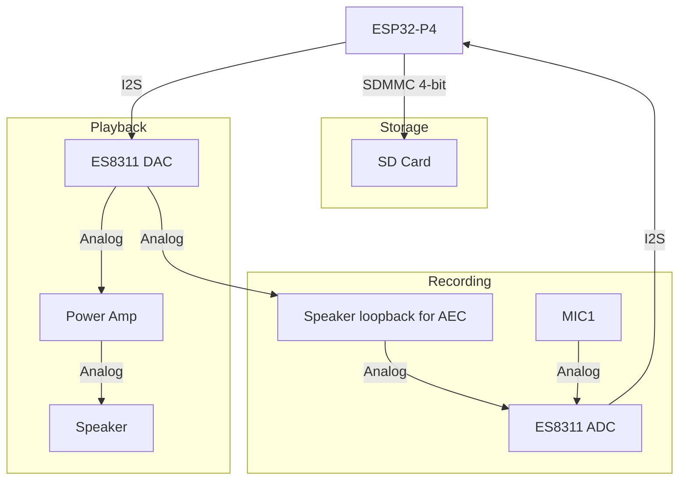

# Resources
- [Docs](https://docs.espressif.com/projects/esp-dev-kits/en/latest/esp32p4/esp32-p4-function-ev-board/index.html)
- [ES8311 audio codec features](ES8311%20audio%20codec%20features.md)
- [ESP32-P4 TRM](https://www.espressif.com/sites/default/files/documentation/esp32-p4_technical_reference_manual_en.pdf)
# Audio processing flowchart

## SD Card (SDMMC 4-bit, not SPI)
- Powered via ESP32-P4 internal LDO (channel 4) — no external regulator needed

| Signal | GPIO    |
| ------ | ------- |
| CLK    | GPIO43  |
| CMD    | GPIO44  |
| D0     | GPIO39  |
| D1     | GPIO40  |
| D2     | GPIO41  |
| D3     | GPIO42  |

## Mic & Line In — ES8311 (ADC)
- ES8311 is a combined codec: single chip handles both ADC (mic/line in) and DAC (speaker out)
- Single mic input on the board (mono ADC) — setting `channels=2` in config does not produce real stereo
- Speaker loopback for AEC feeds back into the ES8311 ADC input (same chip, no second ADC needed)
- ES8311 I2C address: `0x18` (7-bit); pass as `0x18 << 1 = 0x30` to `esp_codec_dev` (driver shifts right)

| Signal     | GPIO   | Function                        |
| ---------- | ------ | ------------------------------- |
| I2S_MCLK   | GPIO13 | I2S Master clock                |
| I2S_BCLK   | GPIO12 | I2S Serial clock (SCLK)         |
| I2S_LRCLK  | GPIO10 | I2S Channel clock (WS)          |
| I2S_DOUT   | GPIO9  | I2S data out — ESP32-P4 → ES8311 DAC |
| I2S_DIN    | GPIO11 | I2S data in — ES8311 ADC → ESP32-P4  |
| I2C_SDA    | GPIO7  | I2C Serial data                 |
| I2C_SCL    | GPIO8  | I2C Serial clock                |

## Speaker — ES8311 (DAC) & Power Amp
- ES8311 DAC output feeds the onboard power amplifier
- PA enable is active-high; drive GPIO53 high before playback

| Signal  | GPIO   |
| ------- | ------ |
| PA_CTRL | GPIO53 |
