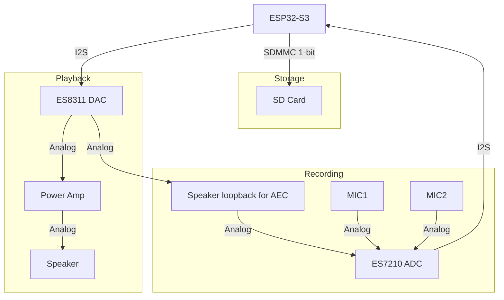

# Resources
- [Wiki](https://docs.espressif.com/projects/esp-adf/en/latest/design-guide/dev-boards/user-guide-esp32-s3-korvo-2.html)
- [schematic](https://dl.espressif.com/dl/schematics/SCH_ESP32-S3-Korvo-2_V3.1.2_20240116.pdf)
- [ES7210_ADC](https://www.lcsc.com/datasheet/C365743.pdf)
- [ES8311_codec](ES8311%20audio%20codec%20features.md)
# Audio processing flowchart

## SD Card (SDMMC 1-bit)

| Signal | GPIO   |
| ------ | ------ |
| CLK    | GPIO15 |
| CMD    | GPIO7  |
| D0     | GPIO4  |
## Mic — ES7210 (ADC)
- ES7210 takes 2 mic inputs at MIC1 & MIC2 for far-field audio
- Takes speaker loopback before amp at MIC3 (ADC_MIC3P/N) for Acoustic Echo Canceling (AEC)
- Shared I2S and I2C bus between ES8311 and ES7210

| Signal    | GPIO   | Function                         |
| --------- | ------ | -------------------------------- |
| I2S_MCLK  | GPIO16 | I2S Master clock (shared)        |
| I2S_SCLK  | GPIO9  | I2S Serial clock (shared)        |
| I2S_LRCLK | GPIO45 | I2S Channel clock (shared)       |
| I2S_DOUT  | GPIO10 | I2S data out — ES7210 → ESP32-S3 |
| I2C_SDA   | GPIO17 | I2C Serial data (shared)         |
| I2C_SCL   | GPIO18 | I2C Serial clock (shared)        |
## Speaker — ES8311 (DAC) & Power Amp

| Signal    | GPIO   | Function                            |
| --------- | ------ | ----------------------------------- |
| I2S_MCLK  | GPIO16 | I2S Master clock (shared)           |
| I2S_SCLK  | GPIO9  | I2S Serial clock (shared)           |
| I2S_LRCLK | GPIO45 | I2S Channel clock (shared)          |
| I2S_DIN   | GPIO8  | I2S data in — ESP32-S3 → ES8311 DAC |
| I2C_SDA   | GPIO17 | I2C Serial data (shared)            |
| I2C_SCL   | GPIO18 | I2C Serial clock (shared)           |
| PA_CTRL   | GPIO48 | Power amp enable (active-high)      |
