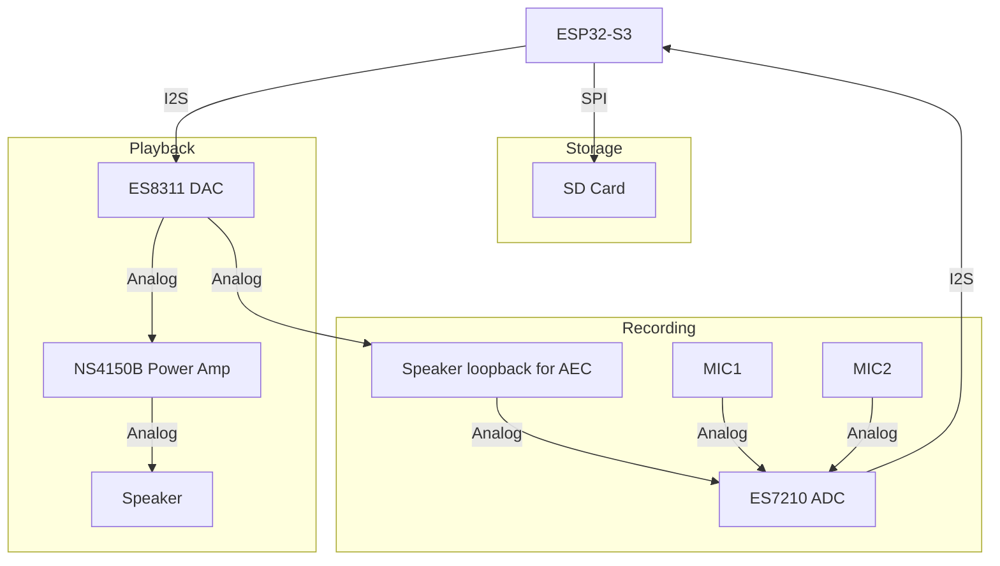

# Resources
- [Wiki](https://www.waveshare.com/wiki/ESP32-S3-Touch-AMOLED-1.75#06_I2SCodec)
- [schematic](https://files.waveshare.com/wiki/ESP32-S3-Touch-AMOLED-1.75/ESP32-S3-Touch-AMOLED-1.75.pdf)
- [ES7210_ADC](https://www.lcsc.com/datasheet/C365743.pdf)
- [ES8311_codec](ES8311%20audio%20codec%20features.md)
- [Software demos](https://github.com/waveshareteam/ESP32-S3-Touch-AMOLED-1.75)
# Audio processing flowchart

## SD Card (SPI mode, not SDMMC)
| Signal | GPIO   |
| ------ | ------ |
| MOSI   | GPIO1  |
| SCK    | GPIO2  |
| MISO   | GPIO3  |
| SDCS   | GPIO41 |
## Mic - ES7210 (ADC) & ES8311 (for AEC)
- ES7210 takes 2 mic inputs at MIC1 & MIC2 for far field audio
- Takes speaker input before amp at MIC3 for Acoustic Echo Canceling (AEC)
-  Shared I2S and I2C bus between ES8311 and ES7210

| ES8311 (Codec) | GPIO   | ES7210 (ADC) | Function                           |
| -------------- | ------ | ------------ | ---------------------------------- |
| I2S_DIN        | GPIO8  | NC           | I2S data in (Speaker) or out (MCU) |
| I2S_SCLK       | GPIO9  | I2S_SCLK     | I2S Serial clock                   |
| NC             | GPIO10 | I2S_DOUT     | I2S data out (Mic) or in (MCU)     |
| I2S_MCLK       | GPIO42 | I2S_MCLK     | I2S Master clock                   |
| I2S_LRCLK      | GPIO45 | I2S_LRCK     | I2S Channel clock                  |
| I2C_SDA        | GPIO14 | I2C_SDA      | I2C Serial data                    |
| I2C_SCL        | GPIO15 | I2C_SCL      | I2C Serial clock                   |
## Speaker - ES8311 (DAC) & NS4150B (Power Amp)
- Takes input signal from ES8311 and amplify to speaker out

| Signal  | GPIO   |
| ------- | ------ |
| PA_CTRL | GPIO46 |
