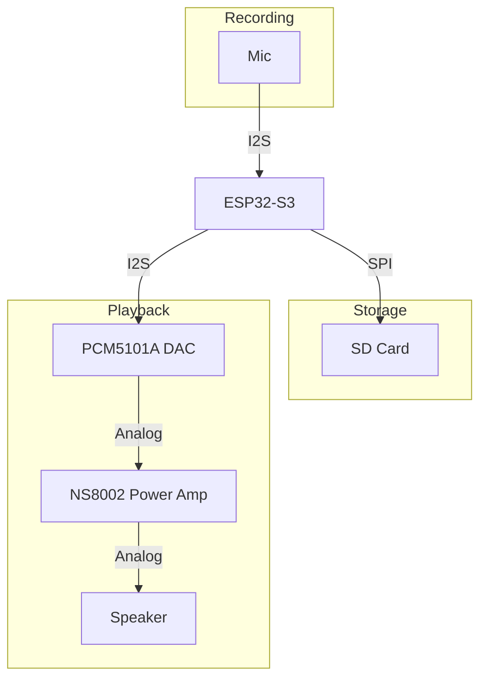

# Resources
- [Wiki](https://www.waveshare.com/wiki/ESP32-S3-Touch-LCD-1.46B#Schematic_Diagram)
- [schematic](https://files.waveshare.com/wiki/ESP32-S3-Touch-LCD-1.46/ESP32-S3-Touch-LCD-1.46.pdf)
- [mic datasheet](https://files.waveshare.com/upload/0/01/MSM261S4030H0R.pdf)
- [Software demos](https://drive.google.com/file/d/1Lh5Gbbdr4TAgwmreNWTZrmsX4vV-tCLx/view)
# Audio processing flowchart

## SD Card (SPI mode, not SDMMC)
- SD_CS uses GPIO expander TCA9554PWR for CS pin
	- MCU --(I2C: SCL=GPIO10, SDA=GPIO11)--> Expander  -> GPExIO (1-8)

| Signal  | GPIO    |
| ------- | ------- |
| SDSCLK  | GPIO14  |
| SD_MISO | GPIO16  |
| SD_MOSI | GPIO17  |
| SD_CS   | GPExIO3 |
## Mic - MSM261S4030H0R (I2S)
| Signal    | GPIO   | Function                       |
| --------- | ------ | ------------------------------ |
| MIC_DOUT  | GPIO2  | I2S Data out (Mic) or in (MCU) |
| MIC_SCLK  | GPIO15 | I2S Serial clock               |
| MIC_LRCLK | GPIO39 | I2S Channel clock              |
| MIC_EN    | 3V3    | Low=Off mic, High=On mic       |
| MIC_LRSEL | 3V3    | Low=Left ch, High=Right ch     |
## Speaker - PCM5101APWR (DAC) & NS8002 (Power Amp)
| Signal    | GPIO   | Function                           |
| --------- | ------ | ---------------------------------- |
| I2S_LRCLK | GPIO38 | I2S Channel clock                  |
| I2S_DIN   | GPIO47 | I2S Data in (Speaker) or out (MCU) |
| I2S_SCLK  | GPIO48 | I2S Serial clock                   |
