# Resources
- [Edge AI Vendor Comparison](Edge%20AI%20vendor%20comparison.md) — ST / Nordic / Infineon platforms

---

# Edge AI — Neural Networks & DSP

How neural networks are actually built, how data flows through them, and what DSP preprocessing looks like before the network ever sees the data.

---

## The Single Neuron

A neuron is a function that takes several numbers in, multiplies each by a **weight**, adds them all up, adds a **bias**, then squashes the result through an **activation function**.

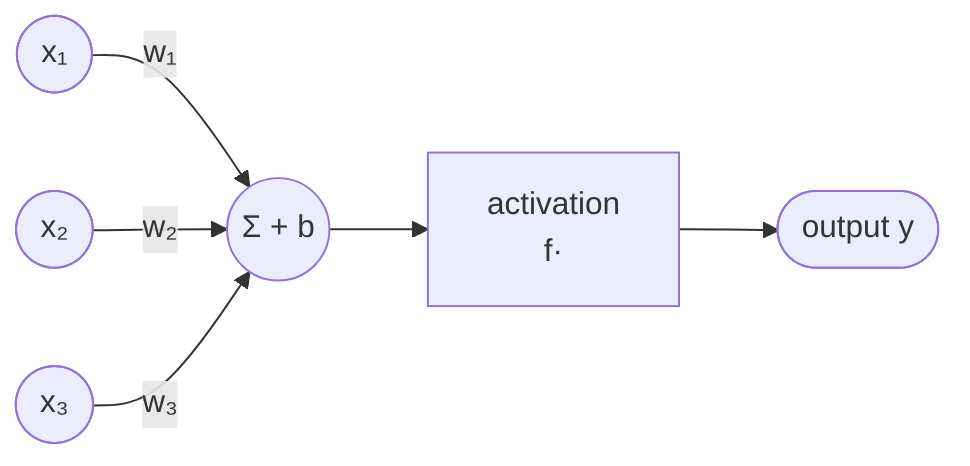

$$y = f\!\left(\sum_i w_i x_i + b\right)$$

**Intuition:**
- **Weights** $w_i$ — how much the neuron cares about each input. A large positive weight means "this input strongly pushes the neuron ON". A negative weight means "this input suppresses the neuron".
- **Bias** $b$ — shifts the activation threshold. Without bias, every neuron is forced to pass through zero — bias lets it fire even when all inputs are zero.
- **Activation function** — without it, the whole network collapses to a single linear equation no matter how many layers you stack. Activations introduce non-linearity, which is what lets the network approximate any function.

---

## Activation Functions

### ReLU (Rectified Linear Unit)

$$f(x) = \max(0,\, x)$$

- Negative inputs → zero. Positive inputs → pass through unchanged.
- **Intuition:** the neuron either fires or it doesn't. Very cheap to compute.
- Most common activation in hidden layers of CNNs and dense layers.
- Problem: **dying ReLU** — if weights push a neuron permanently negative, it outputs zero forever and receives no gradient to recover.

### ReLU6

$$f(x) = \min(\max(0,\, x),\, 6)$$

- Same as ReLU but clipped at 6. Preferred on MCUs because it clips outlier activations — better behaved after INT8 quantization (range 0–6 maps cleanly to 0–255).
- Used in MobileNetV2 and EfficientNet-Lite.

### Sigmoid

$$f(x) = \frac{1}{1 + e^{-x}}$$

- Squashes any value to (0, 1). Looks like an S.
- **Intuition:** probability output. Used in binary classification output layers.
- Expensive on MCU (exponential). Avoided in hidden layers.

### Softmax

$$f(x_i) = \frac{e^{x_i}}{\sum_j e^{x_j}}$$

- Takes a vector → outputs a vector of the same length where all values sum to 1.
- **Intuition:** converts raw scores (logits) into class probabilities. The class with the highest score gets the most probability mass.
- Always used on the final layer of multi-class classifiers.
- Not used mid-network — only at output.

### Tanh

$$f(x) = \frac{e^x - e^{-x}}{e^x + e^{-x}}$$

- Squashes to (-1, 1). Zero-centred unlike sigmoid.
- Used inside LSTM gates. Rarely in CNNs.

### h-swish (MobileNetV3)

$$f(x) = x \cdot \frac{\text{ReLU6}(x + 3)}{6}$$

- Piecewise linear approximation of Swish ($x \cdot \sigma(x)$). Smoother than ReLU, avoids the exponential of true Swish.
- Used in MobileNetV3 because it's faster than sigmoid/Swish on MCU while matching their accuracy.

| Activation | Output range | Cost on MCU | Typical use |
|---|---|---|---|
| ReLU | [0, ∞) | Cheapest (single compare) | Hidden layers of CNNs |
| ReLU6 | [0, 6] | Same as ReLU | MobileNet hidden layers |
| Sigmoid | (0, 1) | Expensive (exp) | Binary output, LSTM gates |
| Softmax | (0, 1) summing to 1 | Medium (exp + divide) | Multi-class output layer |
| Tanh | (-1, 1) | Expensive (exp) | LSTM internal gates |
| h-swish | smooth nonlinear | Cheap (ReLU6 + multiply) | MobileNetV3 |

---

## Weights and What They Encode

After training, every weight in the network encodes a learned pattern. In a CNN:
- **Early conv layer weights** learn to detect low-level features: edges, corners, gradients in specific directions.
- **Middle layer weights** learn to combine those into textures, shapes, parts.
- **Late layer weights** learn high-level concepts: "this arrangement of parts = a dog".

Before training, weights are random (small Gaussian noise). Training adjusts them so the network's output matches the training labels. This is done by computing a **loss** (how wrong the output is) and propagating the error backwards — **backpropagation**.

---

## Layers — What They Are and What They Do

### Dense (Fully Connected) Layer

Every input neuron connects to every output neuron.

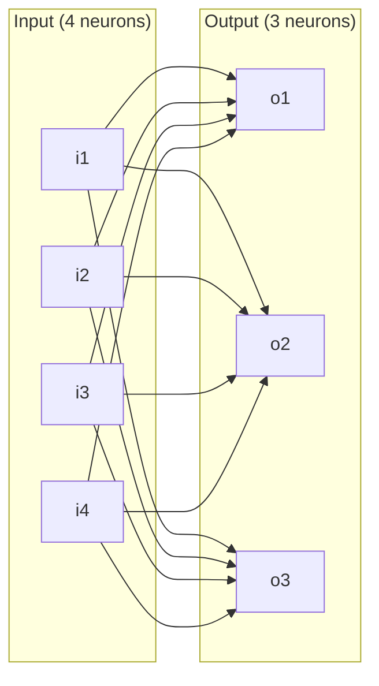

- Parameters: $N_{in} \times N_{out}$ weights + $N_{out}$ biases.
- **Intuition:** the layer learns which combination of input features predicts each output class. Global — it sees everything at once.
- Problem at MCU scale: a 512→256 dense layer has 131,072 weights. Dense layers are parameter-expensive.
- Used at the end of networks (classifier head) after spatial features have been compressed.

### Conv2D Layer

A small filter (kernel) slides across a 2D input (image or feature map) and computes a dot product at each position.

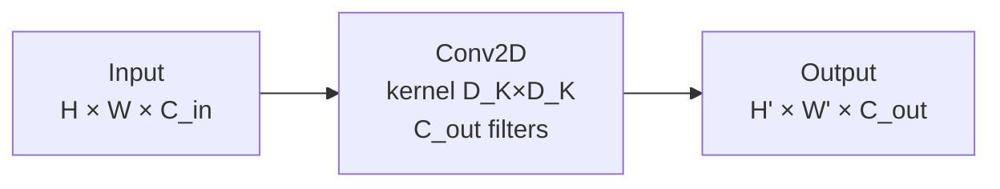

- One filter = one learned spatial pattern (e.g. a vertical edge detector).
- $C_{out}$ filters → $C_{out}$ output channels, each a different pattern detector.
- The same filter is applied at every spatial location → **weight sharing** — massively fewer params vs dense.
- **Intuition:** imagine sliding a magnifying glass across the image, asking "is my pattern here?" at every position. The output is a heatmap of where that pattern exists.
- Parameters: $D_K \times D_K \times C_{in} \times C_{out}$ weights (+ bias per filter).

#### Padding

- **Valid (no padding):** output shrinks by $D_K - 1$ in each dimension.
- **Same:** pad input with zeros so output = same spatial size as input.

#### Stride

- Stride 1: kernel moves one pixel at a time. Output ≈ same size.
- Stride 2: kernel jumps 2 pixels. Output size halved. Faster, fewer activations.

### Depthwise Conv

Each input channel gets its own independent filter — no mixing between channels.

- Parameters: $D_K \times D_K \times C_{in}$ (vs $D_K \times D_K \times C_{in} \times C_{out}$ for standard conv).
- Does spatial pattern detection per channel.
- Always followed by a **pointwise (1×1) conv** to mix channels. Together = depthwise separable conv.
- ~9× fewer MACs than standard conv for 3×3 kernel.

### Conv1D Layer

Same as Conv2D but the kernel slides along only one dimension — time.

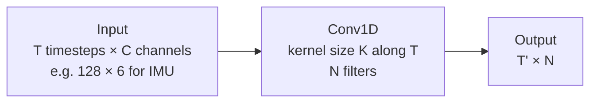

- **Intuition:** sliding a small time window across the signal and asking "does this local temporal pattern appear here?". Learns things like "a sharp acceleration spike", "a 20 ms rise followed by a fall".
- Used for all time-series: IMU, ECG, vibration, PPG.
- 1D equivalent of an edge detector — but detecting temporal edges and patterns instead of spatial ones.

### Pooling Layers

Reduce spatial size by summarising a region into a single value.

| Type | Operation | Intuition |
|---|---|---|
| **MaxPool** | Take the max in each window | "Did this feature appear anywhere in this region?" — yes/no |
| **AvgPool** | Take the mean in each window | "How strongly did this feature appear on average?" |
| **Global Avg Pool (GAP)** | Average the entire spatial map into one value per channel | Collapses H×W → 1×1; replaces flatten + dense in many MCU models |

> [!note] Why Global Avg Pool matters on MCU
> Replacing `Flatten → Dense(1024)` with GAP drops activation RAM dramatically. MobileNet uses GAP as the final spatial reduction before the classifier head. This is why MobileNet inference RAM is tractable on Cortex-M4.

### Batch Normalization (BatchNorm)

Applied after conv (before or after activation). For a mini-batch of activations:

1. Subtract the mean of the batch
2. Divide by the standard deviation
3. Scale and shift by learned $\gamma$ and $\beta$

**Intuition:** stops the activations from drifting to very large or very small values as the network trains. Without it, deep networks are hard to train because early layers' outputs become unstable.

At inference time (on MCU), BatchNorm has no batch — it uses **running mean and variance** collected during training. This means it's a fixed affine transform: $y = \gamma \frac{x - \mu}{\sigma} + \beta$, which gets **fused into the preceding conv layer** by tools like STEdgeAI Core and EON. The BatchNorm layer disappears at deployment — it costs nothing at inference.

> [!note] BatchNorm fusion
> STM32Cube.AI and TFLite converter automatically fold BatchNorm into preceding conv weights. No separate BN layer exists in the deployed model.

### Dropout

During training: randomly set a fraction $p$ of neuron outputs to zero each forward pass. At inference: no dropout — all neurons active.

**Intuition:** forces the network to not rely too heavily on any single neuron. Every neuron has to be useful independently. Acts as regularization — reduces overfitting on small datasets. Common on MCU training because embedded datasets are small.

At inference on MCU: dropout does nothing. Zero cost.

### Embedding Layer

Converts integer token indices to dense float vectors. Used in NLP. Not relevant to sensor/audio edge AI.

---

## How the Forward Pass Works

Every inference is just matrix multiplications and elementwise operations flowing left to right:

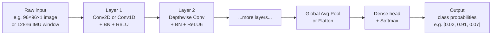

**What 'activations' means:** at each layer, the numbers flowing between layers are called activations (or feature maps). They are NOT stored permanently — they exist in RAM only while that layer is being computed. Once the next layer has consumed them they can be discarded. This is why RAM = peak activation size, not sum of all activations.

**What happens numerically (example for one Conv layer):**
1. Load input patch (e.g. 3×3×64 values from feature map)
2. Multiply elementwise with 3×3×64 filter weights
3. Sum all 576 products → one scalar
4. Add bias
5. Apply ReLU6
6. That scalar is one element of the output feature map
7. Repeat for every position and every filter

---

## Training — How Weights Get Learned

### Loss Function

A scalar that measures how wrong the network's output is. Higher = worse.

| Task | Loss function | Intuition |
|---|---|---|
| Multi-class classification | Cross-entropy | Penalises low confidence on correct class logarithmically |
| Binary classification | Binary cross-entropy | Same but for 2-class |
| Regression | MSE (Mean Squared Error) | Penalises distance from target value quadratically |
| Anomaly detection (autoencoder) | MSE reconstruction error | How different is output from input |

### Backpropagation

After each forward pass, compute the loss. Then propagate the error backwards through every layer using the chain rule of calculus — each weight receives a **gradient** (the derivative of the loss with respect to that weight). The gradient tells the weight "if you increase slightly, the loss goes up/down by this much".

**Intuition:** every weight gets a score saying "you contributed this much to the mistake". Weights that caused big errors get big gradient signals.

### Optimiser

Updates weights using the gradient:

$$w \leftarrow w - \eta \cdot \nabla_w L$$

where $\eta$ is the **learning rate**.

| Optimiser | What it does | Used for |
|---|---|---|
| **SGD** | Gradient descent with optional momentum | Classic; stable; slower |
| **Adam** | Adaptive per-weight learning rates + momentum | Default for most deep learning |
| **RMSProp** | Adaptive learning rates; no momentum term | RNNs, LSTM training |

**Learning rate intuition:** too large → weights overshoot the minimum, training diverges or oscillates. Too small → training crawls, gets stuck in local minima.

### Training Loop

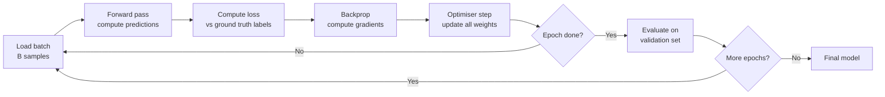

---

## Autoencoder (Anomaly Detection)

An autoencoder is trained to reconstruct its input through a narrow bottleneck. It learns a compressed representation of "normal" data.

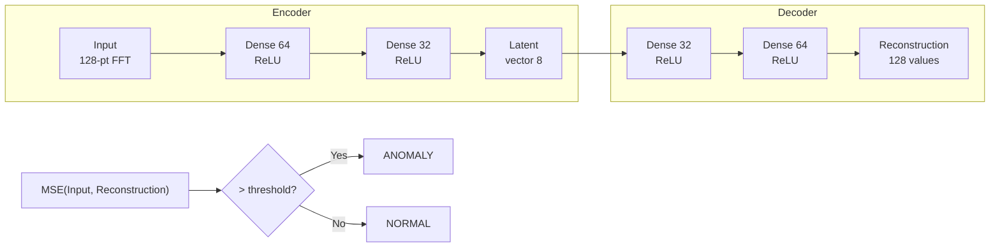

- Trained only on normal data. Can't reconstruct anomalies well → high error → alarm.
- NanoEdge AI Studio uses this approach for vibration/IMU anomaly detection. Returns a similarity % (100 = identical to training distribution).

---

## DSP — Signal Processing Before the Network

Most MCU ML inputs are not raw waveforms fed directly to the network. A preprocessing stage converts the raw signal into features the network can learn from efficiently.

---

## Sampling and Nyquist

A digital sensor samples an analogue signal at fixed intervals. The **sampling rate** $f_s$ (Hz) determines which frequencies can be captured:

$$f_{max} = \frac{f_s}{2} \quad \text{(Nyquist frequency)}$$

Any frequency above $f_s/2$ in the real signal aliases — it folds back into the spectrum as a false lower frequency. Hardware anti-aliasing filters remove content above $f_s/2$ before sampling.

| Sensor | Typical $f_s$ | Nyquist | Captures |
|---|---|---|---|
| IMU (motion / HAR) | 50–400 Hz | 25–200 Hz | Human motion (0–20 Hz) |
| IMU (vibration / anomaly) | 1.6–6.6 kHz | 0.8–3.3 kHz | Machine vibration harmonics |
| Microphone (audio / KWS) | 16 kHz | 8 kHz | Speech (300 Hz–3.4 kHz) |
| Microphone (high quality) | 48 kHz | 24 kHz | Full audio spectrum |

---

## Time Domain vs Frequency Domain

**Time domain:** signal value over time. You see when things happen.

**Frequency domain:** how much energy is present at each frequency. You see what periodic components make up the signal.

**Intuition:** a guitar chord sounds like a single audio waveform in time domain. In frequency domain you see the individual notes (fundamental frequencies + harmonics) as separate peaks. A machine bearing with a damaged ball produces a repeating impact at a specific frequency — invisible in time domain noise, obvious as a peak in frequency domain.

Most edge AI preprocessing moves signals into the frequency domain because:
- Frequency patterns are stable across different time offsets (translation invariant)
- Neural networks learn frequency patterns much faster than raw time patterns

---

## FFT (Fast Fourier Transform)

The FFT converts a block of N time-domain samples into N/2 frequency bins. Each bin represents how much energy is present at a specific frequency.

$$X[k] = \sum_{n=0}^{N-1} x[n] \cdot e^{-j2\pi kn/N}$$

Each output $X[k]$ is complex — magnitude = energy at frequency $k \cdot \frac{f_s}{N}$, phase = timing of that frequency.

For ML we usually only use the **magnitude spectrum** $|X[k]|$.

**Practical parameters:**
| N | Freq resolution at $f_s$=16kHz | Notes |
|---|---|---|
| 256 | 62.5 Hz/bin | Coarse; 128 output bins |
| 512 | 31.25 Hz/bin | Common for audio |
| 1024 | 15.6 Hz/bin | Fine; 512 output bins |

> [!note] FFT size tradeoff
> Larger N → better frequency resolution but worse time resolution (you averaged over more time). For non-stationary signals like speech this is a problem — a 1024-point FFT at 16 kHz spans 64 ms, blurring fast phoneme transitions.

---

## Windowing

Taking an FFT of a finite-length block creates **spectral leakage** — energy from one frequency smears into neighbouring bins because the block edges create discontinuities.

**Fix:** multiply the time block by a **window function** that tapers to zero at both ends before the FFT.

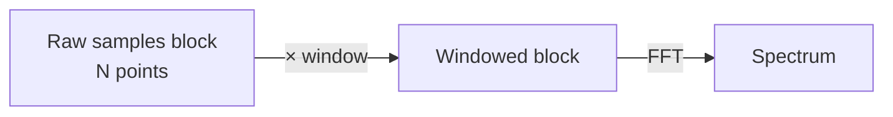

| Window | Sidelobe suppression | Main lobe width | Use |
|---|---|---|---|
| **Rectangular** (none) | Worst (−13 dB) | Narrowest | Not used for audio |
| **Hann** | Good (−31 dB) | Medium | Standard for audio / speech |
| **Hamming** | Good (−41 dB) | Medium | Alternative to Hann; MFCC pipelines |
| **Blackman** | Very good (−58 dB) | Wide | Vibration analysis |

---

## STFT (Short-Time Fourier Transform)

Applying the FFT to overlapping windows over time produces a **spectrogram** — a 2D map of frequency vs time.

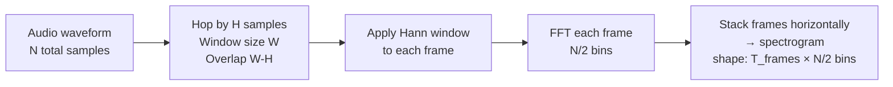

**Key parameters:**
| Parameter | Effect |
|---|---|
| **Window size** W | Frequency resolution = $f_s / W$; time resolution = $W / f_s$ |
| **Hop size** H | Time step between frames; overlap = W - H; smaller hop = more temporal detail |

Typical for 16 kHz KWS: W=512 (32 ms), H=160 (10 ms), 50% overlap → ~98 frames per second.

---

## Mel Filterbank and Mel Spectrogram

The raw FFT spectrum has linear frequency bins. Human hearing (and most sounds we care about) is **logarithmic** — we perceive the difference between 100 Hz and 200 Hz the same as 1000 Hz and 2000 Hz.

The **Mel scale** approximates this:

$$m = 2595 \log_{10}\!\left(1 + \frac{f}{700}\right)$$

A **Mel filterbank** is a set of overlapping triangular filters spaced evenly on the Mel scale applied to the FFT magnitude spectrum:

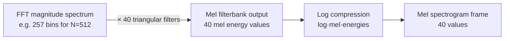

- **40 or 80 Mel bands** is typical for speech (vs 257 FFT bins) — huge dimension reduction with no perceptual loss.
- Log compression: human hearing is logarithmic in amplitude too. $\log(x)$ better represents loudness perception.
- Stack frames → **Log-Mel spectrogram** shape: `T_frames × N_mels`, treated as a grayscale image by the CNN.

---

## MFCC (Mel-Frequency Cepstral Coefficients)

MFCC adds one more step after the log-Mel filterbank: a **DCT (Discrete Cosine Transform)**.

$$c[n] = \sum_{k=0}^{M-1} \log(S[k]) \cdot \cos\!\left(\frac{\pi n}{M}\left(k + \frac{1}{2}\right)\right)$$

- DCT decorrelates the Mel band energies (adjacent bands are correlated by the overlapping filters).
- Keeps only the first 13–40 coefficients (discards high-order DCT terms that carry little info).
- Traditionally used in classical speech recognition (HMMs). Still used in many KWS pipelines.

**MFCC vs Mel spectrogram for NNs:**

| Feature | MFCC | Log-Mel Spectrogram |
|---|---|---|
| Dimension | 13–40 per frame | 40–80 per frame |
| DCT decorrelation | Yes | No |
| Works well with | HMMs, small NNs | CNNs (learns the decorrelation) |
| Used in | Legacy KWS, DS-CNN-S | MobileNetV2 KWS, most modern models |
| Preferred for edge | DS-CNN-S (MFCC 49×10) | MobileNetV2 (mel 49×40) |

---

## Full Audio Preprocessing Pipeline (KWS)

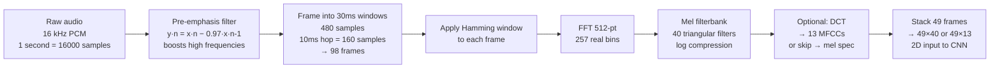

---

## IMU Preprocessing Pipeline (HAR / Gesture)

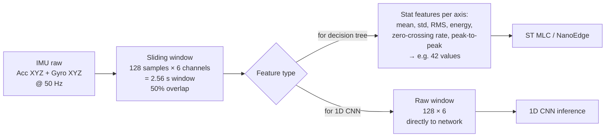

---

## Digital Filters

Filters remove or emphasise specific frequency ranges from a signal before processing.

### Filter Types by Frequency Response

| Filter | Passes | Blocks | Edge AI use |
|---|---|---|---|
| **Low-pass (LPF)** | Low frequencies | High frequencies | Remove high-freq noise from IMU; anti-aliasing |
| **High-pass (HPF)** | High frequencies | Low frequencies | Remove DC offset and slow drift from IMU |
| **Band-pass (BPF)** | Range of frequencies | Above and below | Isolate a specific vibration harmonic |
| **Band-stop / Notch** | Everything except a band | Specific band | Remove 50/60 Hz mains interference |
| **All-pass** | All frequencies | Nothing | Alters phase only; used in filter chains |

---

### FIR Filters (Finite Impulse Response)

$$y[n] = \sum_{k=0}^{M} b_k \cdot x[n-k]$$

The output is a weighted sum of the **current and past** input samples only. No feedback.

**Properties:**
- Always **stable** — no feedback means no runaway poles
- **Linear phase** — all frequencies are delayed equally; waveform shape preserved (important for timing-sensitive signals)
- Requires many coefficients $M$ for sharp frequency cutoffs → higher computational cost
- **Intuition:** a sliding weighted average window. A simple FIR with equal weights = a moving average (LPF).

### IIR Filters (Infinite Impulse Response)

$$y[n] = \sum_{k=0}^{M} b_k \cdot x[n-k] - \sum_{k=1}^{N} a_k \cdot y[n-k]$$

The output depends on past **output** values (feedback). The impulse response is theoretically infinite.

**Properties:**
- Much fewer coefficients for the same frequency selectivity as FIR
- Can be **unstable** if poles are outside the unit circle (improper design)
- **Non-linear phase** — different frequencies are delayed by different amounts; distorts waveform shape
- Common types: Butterworth (maximally flat), Chebyshev (sharper cutoff), Biquad (cascaded 2nd-order sections)
- **Intuition:** the output "remembers" itself; past outputs feed back in. Computationally cheap for sharp filters.

| Property | FIR | IIR |
|---|---|---|
| Stability | Always stable | Can be unstable if not designed carefully |
| Phase | Linear (no distortion) | Non-linear |
| Coefficient count for sharp cutoff | High (many taps) | Low (few coefficients) |
| Computational cost | Higher | Lower |
| MCU use | Pre-emphasis, DC removal | Butterworth LPF/HPF on IMU data |

### Biquad Filter (IIR)

The standard MCU IIR implementation. A 2nd-order section:

$$y[n] = b_0 x[n] + b_1 x[n-1] + b_2 x[n-2] - a_1 y[n-1] - a_2 y[n-2]$$

5 coefficients per section. Complex filters are built as cascaded biquad stages (e.g. 4th-order Butterworth = 2 cascaded biquads). CMSIS-DSP has optimised biquad implementations for Cortex-M.

---

### Moving Average Filter

$$y[n] = \frac{1}{M} \sum_{k=0}^{M-1} x[n-k]$$

The simplest FIR low-pass filter — equal weights, last M samples. Smooths noise. Cheap to compute with a circular buffer. Used for IMU pre-smoothing before feature extraction.

### Pre-Emphasis Filter

$$y[n] = x[n] - \alpha \cdot x[n-1] \qquad \alpha \approx 0.97$$

High-pass FIR with one tap. Boosts high frequencies. Used in audio pipelines before MFCC because speech has more energy at low frequencies — pre-emphasis flattens the spectrum so all phonemes contribute equally.

### DC Removal (High-Pass)

$$y[n] = x[n] - x[n-1] + R \cdot y[n-1] \qquad R \approx 0.99$$

Simple 1-pole IIR high-pass. Removes the DC offset (mean value) from IMU data caused by gravity or sensor bias. Applied before any spectral analysis.

---

## Normalisation

Raw sensor data has arbitrary scale. Normalising brings it to a consistent range before the network.

| Method | Formula | Use |
|---|---|---|
| **Min-Max** | $x' = \frac{x - x_{min}}{x_{max} - x_{min}}$ | Output range [0, 1]; needs global min/max |
| **Z-score** | $x' = \frac{x - \mu}{\sigma}$ | Zero mean, unit variance; robust to outliers |
| **Per-sample** | Z-score over each window | For IMU windows; removes effect of sensor orientation |
| **Global** | Z-score with training-set stats | Fixed $\mu$ and $\sigma$ baked into model preprocessing |

> [!important] Normalisation must match training stats
> If you train with Z-score using $\mu=1.2$, $\sigma=0.4$ from training data, inference must apply exactly those same values. If the normalisation at inference differs from training, accuracy collapses. Both NanoEdge and DEEPCRAFT Studio handle this automatically by embedding the normalisation params in the generated library.
