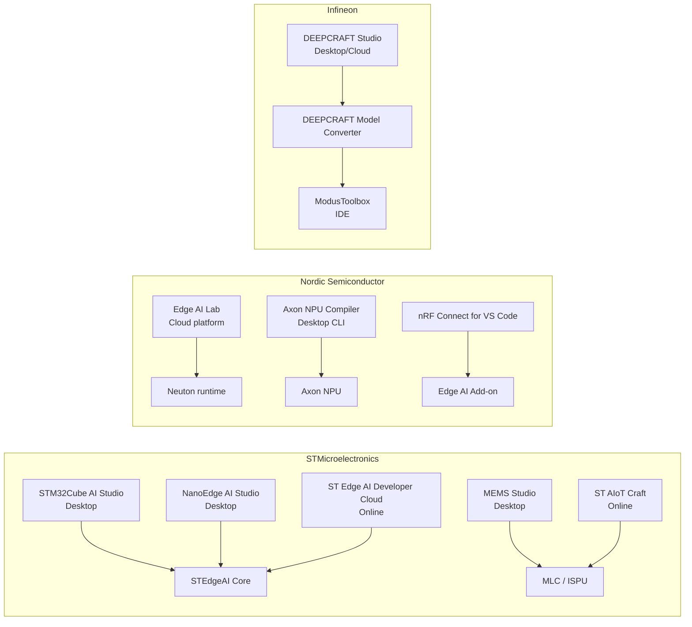
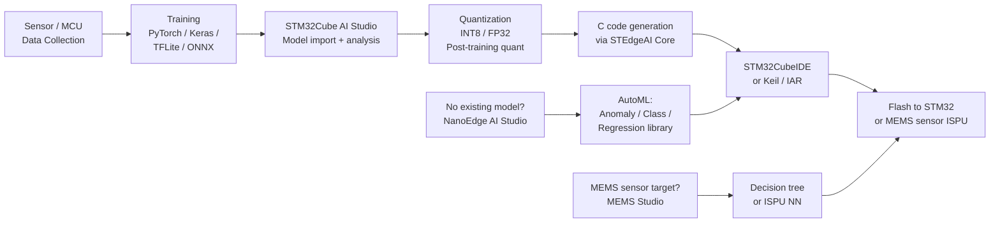
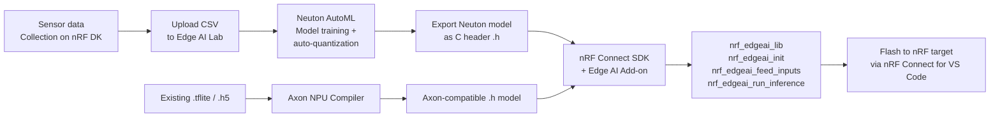
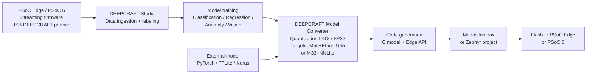

# Resources

- [Edge AI — Neural Networks & DSP](Edge%20AI%20%E2%80%94%20Neural%20Networks%20%26%20DSP.md) — how nets are built, layers, activations, DSP filters
- [Edge AI — ML Concepts](Edge%20AI%20%E2%80%94%20ML%20Concepts.md) — quantization, compression, deployment metrics, architecture selection
- [MLC (Machine Learning Core)](../Hardware/BCM/README.md) — ST MLC on MEMS sensors
- [STM32 notes](../Hardware/README.md)

---

# Edge AI Vendor Comparison — ST / Nordic / Infineon

## Terminology

| Vendor   | Brand / Product Name                          | What It Is                                                                                            |
| -------- | --------------------------------------------- | ----------------------------------------------------------------------------------------------------- |
| ST       | **ST Edge AI Suite**                          | Umbrella brand covering all ST edge AI tools and hardware                                             |
| ST       | **STM32Cube.AI** (formerly X-CUBE-AI)         | Neural network optimization + C-code generator for STM32                                              |
| ST       | **STEdgeAI Core**                             | The underlying engine behind STM32Cube.AI and STM32Cube AI Studio                                     |
| ST       | **STM32Cube AI Studio**                       | Newer standalone desktop tool replacing X-CUBE-AI plugin                                              |
| ST       | **NanoEdge AI Studio**                        | AutoML tool: generates anomaly detection / classification / regression libraries without ML expertise |
| ST       | **ST Edge AI Developer Cloud**                | Online hosted version of STEdgeAI Core                                                                |
| ST       | **Neural-ART Accelerator**                    | ST's in-house NPU inside STM32N6; 600 GOPS at 3 TOPS/W                                                |
| ST       | **MLC (Machine Learning Core)**               | Hardware decision-tree engine inside MEMS sensors (LSM6DSOX, LSM6DSR, etc.)                           |
| ST       | **ISPU (Intelligent Sensor Processing Unit)** | Programmable Cortex-like core inside MEMS sensors (ISM330IS, LSM6DSO16IS)                             |
| ST       | **MEMS Studio**                               | Desktop tool for MLC and ISPU model design on MEMS sensors                                            |
| ST       | **ST AIoT Craft**                             | Online tool for MLC model design                                                                      |
| ST       | **STM32 AI Model Zoo**                        | 140+ pre-trained, STM32-optimized models on GitHub and Hugging Face                                   |
| Nordic   | **Axon NPU**                                  | Nordic's proprietary NPU core; first deployed in nRF54LM20B                                           |
| Nordic   | **Edge AI Lab**                               | Cloud platform for training and exporting Neuton models                                               |
| Nordic   | **Neuton**                                    | Acquired AutoML framework (2025); grows models neuron-by-neuron; up to 1000× smaller than TF models   |
| Nordic   | **nRF Edge AI Library** (`nrf_edgeai_lib`)    | C runtime library for integrating Neuton / Axon models in nRF Connect SDK apps                        |
| Nordic   | **Edge AI Add-on for nRF Connect SDK**        | SDK extension: NPU drivers, inference lib, Axon compiler, code samples                                |
| Infineon | **DEEPCRAFT AI Suite**                        | Umbrella brand for Infineon edge AI software (launched ~2025, replaces Imagimob branding)             |
| Infineon | **DEEPCRAFT Studio**                          | IDE for data collection, model training, and code generation (formerly Imagimob Studio)               |
| Infineon | **DEEPCRAFT Ready Models**                    | Pre-built deployable models (formerly Imagimob Ready Models)                                          |
| Infineon | **DEEPCRAFT Model Converter**                 | Converts PyTorch / TFLite / Keras models for PSoC Edge and PSoC 6                                     |
| Infineon | **NNLite**                                    | Infineon's proprietary ultra-low-power NN hardware accelerator on PSoC Edge Cortex-M33 domain         |
| Infineon | **PSoC Edge**                                 | MCU family with ML acceleration (E81 / E83 / E84)                                                     |

---

## Inference Engine / Runtime

| Vendor | Runtime Under the Hood |
|---|---|
| ST (STM32Cube.AI) | Proprietary ST runtime generated from model; uses CMSIS-NN kernels where available for INT8 ops; also supports TFLite Micro runtime path |
| ST (NanoEdge AI Studio) | Proprietary ST AutoML-generated C library; no TFLite dependency |
| ST (STM32N6 Neural-ART) | ST Neural-ART hardware accelerator; runtime generated by STEdgeAI Core |
| ST (ISPU) | Custom ISPU toolchain compiling ANSI C / neural networks to ISPU instruction set |
| ST (MLC) | Fixed-function decision tree engine in sensor hardware; no runtime binary |
| Nordic (CPU-only, nRF52/53) | TFLite Micro (via Edge Impulse EON compiler or stock TFLM), Neuton proprietary runtime |
| Nordic (Axon NPU, nRF54LM20B) | Axon compiler converts `.tflite` / `.h5` → Axon-native model; executed by Axon NPU hardware; wrapped by `nrf_edgeai_lib` |
| Infineon (PSoC 6) | TFLite Micro; DEEPCRAFT Studio generates TFLite-compatible C code |
| Infineon (PSoC Edge, Ethos-U55) | Arm Ethos-U55 NPU with Vela compiler; DEEPCRAFT Model Converter handles PyTorch / TFLite / Keras |
| Infineon (PSoC Edge, NNLite) | NNLite hardware accelerator on M33 domain for always-on inference |

> [!note] CMSIS-NN in ST toolchain
> X-CUBE-AI / STM32Cube.AI uses CMSIS-NN kernels for INT8 ops. When running TFLite Micro directly on STM32, CMSIS-NN is used as the optimized kernel backend, but the ST-generated runtime is a separate, flatter code path that avoids TFLite Micro overhead.

---

## Primary Toolbox / IDE

| Vendor | Primary Tool | Hosted / Desktop | Input Formats |
|---|---|---|---|
| ST | **STM32Cube AI Studio** | Desktop (Windows / Linux) | `.tflite`, `.h5`, `.onnx` |
| ST | **NanoEdge AI Studio** | Desktop (Windows) | Raw sensor CSV; auto-generates library |
| ST | **MEMS Studio** | Desktop | Sensor data logs → MLC decision tree or ISPU NN |
| Nordic | **Edge AI Lab** (`lab.neuton.ai`) | Cloud | Labeled CSV sensor data |
| Nordic | **nRF Connect for VS Code** + Edge AI Add-on | Desktop | Neuton `.h` model output; `.tflite` via Axon compiler |
| Infineon | **DEEPCRAFT Studio** | Desktop + Cloud | Raw sensor streams via USB streaming protocol; imports PyTorch / TFLite / Keras |
| Infineon | **ModusToolbox** | Desktop (Eclipse-based) | Generated C model from DEEPCRAFT Studio |

---

## Pipeline: Data Collection → Deployment

### STMicroelectronics

**ST pipeline details:**
1. **Data collection** — any sensor/MCU, export raw data; NanoEdge collects directly from STM32 UART
2. **Training** — bring your own model (TFLite / Keras / ONNX) or use NanoEdge AutoML or MEMS Studio decision tree builder
3. **Quantization** — STEdgeAI Core applies INT8 post-training quantization; reports per-layer RAM/Flash/MACC
4. **Code gen** — STEdgeAI Core emits optimized C with CMSIS-NN kernels; NanoEdge emits a static `.a` library
5. **Deploy** — integrate into STM32CubeIDE project; flash via ST-Link

### Nordic Semiconductor

**Nordic pipeline details:**
1. **Data collection** — collect from nRF DK; Edge AI Lab accepts labeled CSV
2. **Training** — Edge AI Lab (Neuton) grows model neuron-by-neuron; fully automated; no architecture design
3. **Quantization** — Neuton framework auto-quantizes; supports FP and INT8 models; Axon compiler handles `.tflite` → Axon format with quantization loss metrics
4. **Code gen** — Neuton exports C header; Axon compiler emits header + test vectors
5. **Deploy** — integrate via `nrf_edgeai_lib` in nRF Connect SDK project; three API calls: init → feed → infer

> [!important] Axon NPU availability
> The nRF54LM20B with Axon NPU is sampling to selected customers as of Q1 2026; broad availability expected Q2 2026. All current production nRF5x/9 series use CPU-only inference via Neuton or Edge Impulse.

### Infineon

**Infineon pipeline details:**
1. **Data collection** — PSoC Edge / PSoC 6 flashed with streaming firmware; streams IMU, mic, radar, pressure, etc. over USB into DEEPCRAFT Studio
2. **Training** — DEEPCRAFT Studio trains classification / regression / anomaly detection / YOLO vision models
3. **Quantization** — DEEPCRAFT Model Converter: INT8 (int8x8) default or FP32; per-core quantization settings for M55 vs M33 domains
4. **Code gen** — outputs Edge API C code; bidirectional integration with ModusToolbox
5. **Deploy** — import generated code into ModusToolbox project; flash via KitProg3

---

## Target Hardware

### STMicroelectronics

| Hardware | AI Capability | Tool |
|---|---|---|
| **STM32N6** (Cortex-M55 @ 800 MHz) | Neural-ART NPU @ 600 GOPS, 3 TOPS/W | STM32Cube AI Studio, STEdgeAI Core |
| **STM32H7** series | CPU-only inference; fastest pre-N6 STM32 | STM32Cube.AI / X-CUBE-AI |
| **STM32U5** series | Low-power; Cortex-M33 | STM32Cube.AI |
| **STM32L4** series | Entry-level; Cortex-M4 | STM32Cube.AI, NanoEdge AI Studio |
| **STM32F4 / F7** | Legacy support | STM32Cube.AI |
| **All STM32 (Cortex-M0+)** | NanoEdge AutoML libraries | NanoEdge AI Studio |
| **ISM330IS / ISM330ISNX** | ISPU (IMU with programmable core) | MEMS Studio, NanoEdge AI Studio |
| **LSM6DSO16IS / LSM6DSO16ISN** | ISPU (6-axis IMU) | MEMS Studio, NanoEdge AI Studio |
| **LSM6DSOX / LSM6DSR / LSM6DSV** | MLC (decision tree in MEMS) | MEMS Studio, ST AIoT Craft |

> [!note] STM32N6 NPU detail
> Neural-ART Accelerator: 300 configurable MAC units, two 64-bit AXI memory buses, 600 GOPS throughput. STM32N6x7 includes Neural-ART; STM32N6x5 omits it (general purpose high-performance only).

### Nordic Semiconductor

| Hardware | AI Capability | Tool / Runtime |
|---|---|---|
| **nRF52805 / nRF52810 / nRF52832** | CPU-only (Cortex-M4); ultra-constrained | Neuton (Edge AI Lab) |
| **nRF52840** | Cortex-M4F; TinyML via Edge Impulse or Neuton | Edge Impulse, Neuton |
| **nRF5340** (dual Cortex-M33) | Better performance; TinyML via Edge Impulse or Neuton | Edge Impulse, Neuton |
| **nRF54L15** | Cortex-M33; flagship low-power without NPU | Neuton |
| **nRF9160** | Cortex-M33; cellular IoT | Edge Impulse |
| **nRF54LM20B** | Cortex-M33 + RISC-V coprocessor + **Axon NPU @ 128 MHz**; 2 MB NVM, 512 KB RAM | Axon NPU Compiler, nrf_edgeai_lib |
| **Nordic Thingy:53** | nRF5340-based dev platform | Neuton (gesture demo), Edge Impulse |
| **Nordic Thingy:91** | nRF9160-based cellular | Edge Impulse |

### Infineon

| Hardware | AI Capability | ML Accelerator | Tool |
|---|---|---|---|
| **PSoC 6** (CY8C6xx) | Cortex-M4 + M0+; CPU-only ML | None | DEEPCRAFT Studio → TFLite Micro |
| **PSoC Edge E81** | Cortex-M55 @ 400 MHz + M33 @ 200 MHz | No Ethos-U55; NNLite on M33 | DEEPCRAFT Studio, ModusToolbox |
| **PSoC Edge E83** | Cortex-M55 + M33 + **Ethos-U55** (128 MACs) | Ethos-U55 + NNLite | DEEPCRAFT Studio, ModusToolbox |
| **PSoC Edge E84** | Cortex-M55 + M33 + **Ethos-U55** (128 MACs) + 2.5D GPU + display controller | Ethos-U55 + NNLite | DEEPCRAFT Studio, ModusToolbox |

**PSoC Edge E84 details:** 5 MB SRAM (M55 domain), 1 MB SRAM (M33 domain), QSPI + Octal HyperRAM, MIPI-DSI/DBI display up to 1024×768, XENSIV radar support. Targets: smart audio, computer vision (YOLO object detection, face recognition), HMI.

---

## Key Differentiators

| | STMicroelectronics | Nordic Semiconductor | Infineon |
|---|---|---|---|
| **AI in sensor** | Yes — MLC (decision tree) and ISPU (NN) directly in MEMS sensor silicon | No | No |
| **In-house NPU** | Neural-ART (STM32N6); 600 GOPS | Axon NPU (nRF54LM20B); up to 15× CPU; sampling Q1 2026 | Ethos-U55 (ARM IP, not in-house) + NNLite (in-house, low-power) |
| **AutoML (no model design)** | NanoEdge AI Studio; also MEMS Studio auto-feature selection | Edge AI Lab (Neuton) | DEEPCRAFT Studio |
| **Bring-your-own-model** | Yes — TFLite, Keras, ONNX via STM32Cube AI Studio | Yes — `.tflite` / `.h5` via Axon compiler | Yes — PyTorch, TFLite, Keras via DEEPCRAFT Model Converter |
| **Wireless connectivity** | No built-in wireless on MCU (separate modules) | Yes — BLE, Thread, Matter, LTE-M, NB-IoT built in | No built-in wireless on PSoC Edge |
| **Computer vision** | STM32N6 + Neural-ART; image classification, detection | Limited (no camera-class NPU yet) | PSoC Edge E83/E84 + Ethos-U55; YOLO-based detection |
| **Sensor ecosystem** | Deep — MEMS with MLC/ISPU, STM32 family | Requires external sensors | XENSIV radar integration, external IMU/mic |

---

## Resources

### STMicroelectronics

| Resource | Link |
|---|---|
| ST Edge AI Suite (overview) | [st.com](https://www.st.com/content/st_com/en/st-edge-ai-suite.html) |
| STM32Cube.AI / STEdgeAI Core | [stm32ai.st.com](https://stm32ai.st.com/stm32-cube-ai/) |
| NanoEdge AI Studio | [stm32ai.st.com/nanoedge-ai](https://stm32ai.st.com/nanoedge-ai/) |
| STM32 AI Model Zoo | [github.com/STMicroelectronics/stm32ai-modelzoo](https://github.com/STMicroelectronics/stm32ai-modelzoo) |
| STM32AI GitHub hub | [github.com/STMicroelectronics/STM32AI_Overall_Offer](https://github.com/STMicroelectronics/STM32AI_Overall_Offer) |
| MEMS ISPU GitHub | [github.com/STMicroelectronics/st-mems-ispu](https://github.com/STMicroelectronics/st-mems-ispu) |
| STM32Cube.AI Wiki | [wiki.st.com](https://wiki.st.com/stm32mcu/wiki/AI:X-CUBE-AI_documentation) |
| AI intro (stm32mcu wiki) | [wiki.st.com AI intro](https://wiki.st.com/stm32mcu/wiki/AI:Introduction_to_Artificial_Intelligence_with_STM32) |
| STM32Cube.AI Workshop MOOC (YouTube) | [Class Central](https://www.classcentral.com/course/youtube-mooc-stm32cube-ai-workshop-53196) |
| Introduction to STM32Cube.AI MOOC | [st.com MOOC](https://www.st.com/content/st_com/en/support/learning/stm32-education/stm32-moocs/Introduction_to_STM32CubeAI_MOOC.html) |
| All ST MOOCs | [st.com/moocs](https://www.st.com/content/st_com/en/support/learning/stm32-education/stm32-moocs.html) |
| STM32N6 overview | [st.com/stm32n6](https://www.st.com/en/microcontrollers-microprocessors/stm32n6-series.html) |
| Neural-ART intro PDF | [st.com PDF](https://www.st.com/resource/en/product_presentation/st-neural-art-accelerator-introduction.pdf) |
| MEMS Studio | [st.com/mems-studio](https://www.st.com/en/development-tools/mems-studio.html) |

### Nordic Semiconductor

| Resource | Link |
|---|---|
| Edge AI overview | [nordicsemi.com/Edge-AI](https://www.nordicsemi.com/Products/Technologies/Edge-AI) |
| Edge AI Lab (Neuton cloud) | [nordicsemi.com/Edge-AI-Lab](https://www.nordicsemi.com/Products/Technologies/Edge-AI/Edge-AI-Lab) |
| Axon NPU | [nordicsemi.com/Axon-NPU](https://www.nordicsemi.com/Products/Technologies/Edge-AI/Axon-NPU) |
| Neuton models | [nordicsemi.com/Neuton-models](https://www.nordicsemi.com/Products/Technologies/Edge-AI/Neuton-models) |
| Edge AI Add-on SDK (GitHub) | [github.com/nrfconnect/sdk-edge-ai](https://github.com/nrfconnect/sdk-edge-ai) |
| Axon NPU DevZone blog | [devzone blog](https://devzone.nordicsemi.com/nordic/nordic-blog/b/blog/posts/meet-the-axon-npu) |
| Neuton custom models blog | [devzone blog](https://devzone.nordicsemi.com/nordic/nordic-blog/b/blog/posts/introducing-custom-neuton-models) |
| Thingy:53 gesture example (GitHub) | [github.com](https://github.com/nordicsemi-neuton/nrf-edgeai-thingy53-ble-remotecontrol) |
| Webinar — ultra-tiny ML with Neuton | [nordicsemi.com webinar](https://www.nordicsemi.com/Resources/Training/Webinars/2025/Building-ultra-tiny-ML-models-for-any-wireless-SoC-with-Neuton) |
| nRF Connect SDK get started | [nordicsemi.com](https://www.nordicsemi.com/Products/Development-software/nRF-Connect-SDK/GetStarted) |
| nRF54LM20B announcement | [nordicsemi.com news](https://www.nordicsemi.com/Nordic-news/2026/01/nRF54L-Series-SoC-with-NPU-and-Nordic-Edge-AI-Lab-make-on-device-intelligence-easily-accessible) |
| Edge Impulse + Nordic BLE TinyML | [edgeimpulse.com blog](https://www.edgeimpulse.com/blog/nordic-embedded-machine-learning/) |

### Infineon

| Resource                              | Link                                                                                                                                      |
| ------------------------------------- | ----------------------------------------------------------------------------------------------------------------------------------------- |
| DEEPCRAFT AI Suite                    | [infineon.com/deepcraft](https://www.infineon.com/design-resources/embedded-software/deepcraft-edge-ai-solutions/)                        |
| DEEPCRAFT Studio                      | [infineon.com/deepcraft-studio](https://www.infineon.com/design-resources/embedded-software/deepcraft-edge-ai-solutions/deepcraft-studio) |
| DEEPCRAFT developer docs              | [developer.imagimob.com](https://developer.imagimob.com/)                                                                                 |
| PSoC Edge E84 product page            | [infineon.com/psoc-edge-e84](https://www.infineon.com/products/microcontroller/32-bit-psoc-arm-cortex/32-bit-psoc-edge-arm/psoc-edge-e84) |
| PSoC 6 AI Eval Kit (CY8CKIT-062S2-AI) | [infineon.com](https://www.infineon.com/cms/en/product/evaluation-boards/cy8ckit-062s2-ai/)                                               |
| PSoC 6 AI Kit getting started         | [imagimob.com](https://www.imagimob.com/getting-started-with-cy8ckit-062s2-ai)                                                            |
| PSoC Edge E84 AI Kit getting started  | [developer.imagimob.com](https://developer.imagimob.com/deepcraft-studio/getting-started/infineon-boards/psoc-edge-e84-ai-kit)            |
| GitHub — data collection example      | [github.com/Infineon](https://github.com/Infineon/mtb-example-psoc-edge-ml-deepcraft-data-collection)                                     |
| GitHub — deploy motion                | [github.com/Infineon](https://github.com/Infineon/mtb-example-psoc-edge-ml-deepcraft-deploy-motion)                                       |
| GitHub — deploy audio                 | [github.com/Infineon](https://github.com/Infineon/mtb-example-psoc-edge-ml-deepcraft-deploy-audio)                                        |
| GitHub — deploy radar                 | [github.com/Infineon](https://github.com/Infineon/mtb-example-psoc-edge-ml-deepcraft-deploy-radar)                                        |
| GitHub — deploy vision                | [github.com/Infineon](https://github.com/Infineon/mtb-example-psoc-edge-ml-deepcraft-deploy-vision)                                       |
| GitHub — ready models                 | [github.com/Infineon](https://github.com/Infineon/mtb-example-psoc-edge-ml-deepcraft-deploy-ready-model)                                  |
| Hackster contest (PSoC ML)            | [hackster.io](https://www.hackster.io/contests/InfineonMLModel)                                                                           |
