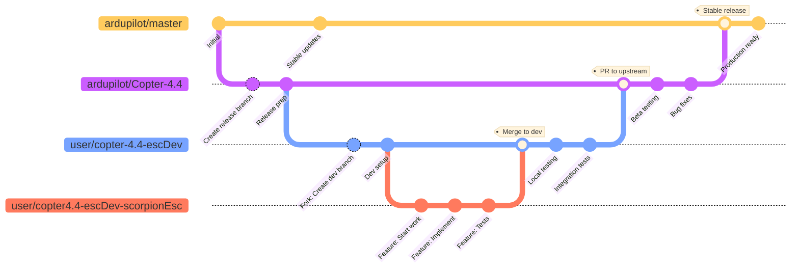
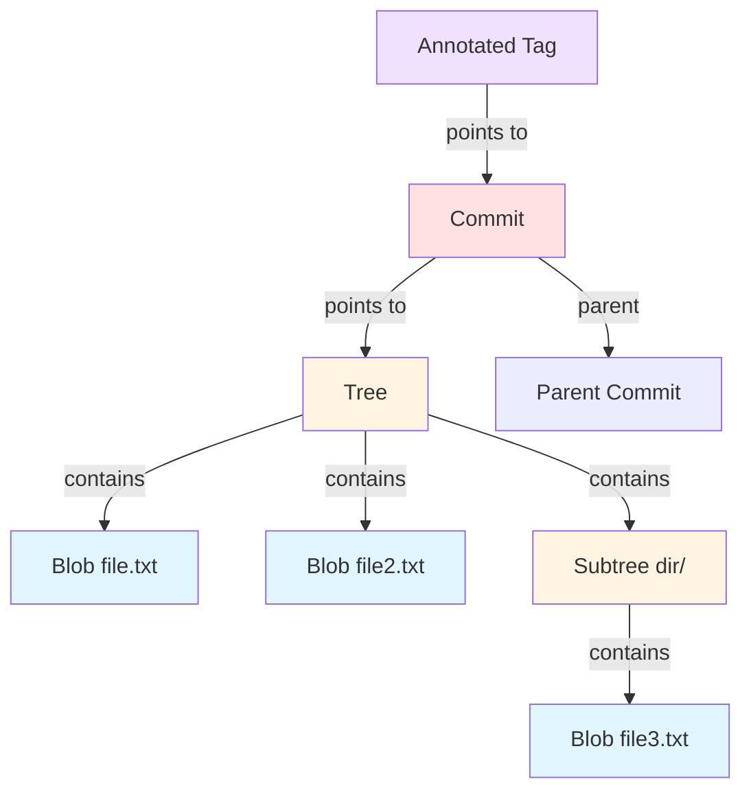
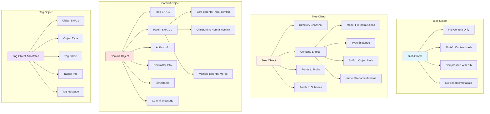

# Commands
## Understanding the Command Line Structure

```
username@computername:~$ command [--flag(s)] [--option(s) [value]] [arguments]
```
**What each part means:**
- `username@computername` - Shows who you are and which machine you're on
- `~` - Your current location (home directory in this case)
- `$` - Prompt symbol (you type commands after this)
- `command` - The name of the application that you want to run (every command is an application, with some exceptions)
- options are like flags but with argument
## Bash Symbols & Operators

| Symbol   | Name              | Purpose                                | Example                         |
| -------- | ----------------- | -------------------------------------- | ------------------------------- |
| `.`      | Current directory | Refers to where you are right now      | `./script.sh` (run script here) |
| `..`     | Parent directory  | One level up from current location     | `cd ..` (go up one level)       |
| `~`      | Home directory    | Your user's home folder                | `cd ~` (go to your home)        |
| `/`      | Root/Separator    | Root directory or separates path parts | `/home/user/docs`               |
| ` `\|` ` | Pipe              | Send output of one command to another  | `ls \| grep "file"`             |
| `-`      | Short flag        | Single-letter option for commands      | `ls -l`                         |
| `--`     | Long flag         | Word-based option (more readable)      | `ls --all`                      |
### Directory Shortcuts (Navigation Symbols)
| Symbol | Meaning                          | Example                         |
| ------ | -------------------------------- | ------------------------------- |
| `.`    | Current directory                | `./script.sh` (run script here) |
| `..`   | Parent directory                 | `cd ..` (go up one level)       |
| `~`    | Home directory                   | `cd ~` (go to your home)        |
| `/`    | Root directory or path separator | `/home/user/docs`               |
### Special Operators
| Symbol   | Name       | Purpose                               | Example               |
| -------- | ---------- | ------------------------------------- | --------------------- |
| ` `\|` ` | Pipe       | Send output of one command to another | `ls `\|` grep "file"` |
| `-`      | Short flag | Single-letter options                 | `ls -l`               |
| `--`     | Long flag  | Word-based options (more readable)    | `ls --all`            |
### Essential Bash Commands
| Command              | Category             | What It Does                                                | Example / Notes                                                      |
| -------------------- | -------------------- | ----------------------------------------------------------- | -------------------------------------------------------------------- |
| `which <command>`    | Information          | Shows where a command is located on your system             | `which python` → `/usr/bin/python`                                   |
| `type <command>`     | Information          | Shows what kind of command it is (built-in, alias, or file) | `type cd` → "cd is a shell builtin"                                  |
| `man <command>`      | Information          | Opens the manual/help page for any command                  | `man ls` (press `q` to exit)                                         |
| `echo <text>`        | Viewing & Creating   | Prints text to the screen                                   | `echo "Hello World"`                                                 |
| `cat <file>`         | Viewing & Creating   | Displays file contents                                      | `cat readme.txt`                                                     |
| `touch <filename>`   | Viewing & Creating   | Creates an empty file                                       | `touch newfile.txt`                                                  |
| `pwd`                | Navigation & Listing | Print Working Directory (shows where you are)               | Shows full path like `/home/user/documents`                          |
| `cd <directory>`     | Navigation & Listing | Change directory                                            | `cd ..` (up), <br>`cd ~` (home), <br>`cd /path/to/folder`            |
| `ls`                 | Navigation & Listing | Lists files and folders                                     | `ls -l` (detailed), <br>`ls -a` (show hidden)                        |
| `cp <source> <dest>` | File Operations      | Copy files or folders                                       | File: `cp file.txt backup.txt`<br>Folder: `cp -r folder/ newfolder/` |
| `mv <source> <dest>` | File Operations      | Move or rename files                                        | `mv oldname.txt newname.txt`                                         |
| `rm <file>`          | File Operations      | Remove (delete) files ⚠️ **No undo!**                       | File: `rm file.txt`<br>Folder: `rm -r foldername/`                   |
| `clear`              | ---                  | to clean up your terminal screen                            | ---                                                                  |
>Press `Tab` to autocomplete commands and filenames
>Press `↑` and `↓` arrows to scroll through previous commands
>Use `Ctrl+C` to cancel a running command
## Git Setup
- **Installing Git**
	- **Linux setup & WSL**
		- `sudo apt update` : Update software repository trackers (to get the latest stable releases)
		- `sudo apt install git` : Install git
	- **MacOS** (Usually pre-installed, check with `git --version`)
		- `brew install git` : Install git
	- **Windows**
		- go to [git-scm](https://git-scm.com/install/windows) and download the latest git version
		- Install with the following recommended setting : 
			- Use Git from the command line and also from 3rd-party software ​
			- Use the OpenSSL library​
			- Checkout Windows-style, commit Unix-style line endings​
			- Use Window's default console window​
			- Enable Git Credential Manager
		- Then go to Git Bash in windows and follow along
- `git --version` : check the version of downloaded git
- **Configuring user info**
	- `git config --global user.name <your name>` : Configure code editor's name​
	- `git config --global user.email <your email>` : Configure ​code editor's email
	- `git config --global init.defaultBranch main​` : Configure default branch to main (historically master)
- **SSH key setup for authentication with your Github repo**
	- `ssh-keygen -t ed25519 -C "email@example.com"​` : Generate ssh-key with ed25519 encryption and given email id
		- Creates `~/.ssh/id_25519` : private key, keep safe, on your system only
		- Creates `~/.ssh/id_25519.pub` : public key, share with service provider, github in our case
	- `eval "$(ssh-agent -s)"​` : Start the SSH-agent in the background
	- **Adding newly generated key to SSH-agent**
		- **Linux & WSL** : `ssh-add ~/.ssh/id_ed25519​`
		- **Adding SSH key in MacOS** : `ssh-add --apple-use-keychain ~/.ssh/id_ed25519`
	- `cat ~/.ssh/id_ed25519.pub​` : Copy all the content of the SSH public key to terminal
		- Or use `pbcopy < ~/.ssh/id_ed25519.pub` to directly copy to clipboard in MacOS

> **Now take that and add this public key to your Github account setting**
## Repository Setup
- `git init` : Initialize new git repository
- `git clone` : Clone remote repository into a folder on local machine
- `touch .gitignore README.md` : Create .gitignore and README.md for your repository. 
## Daily git operations
- `git status` : Check repository status
- `git add <path/to/file/filename>` : Stage the changes in the file "filename"
	- `git add .` : add everything
	- `git add *. js` : add all file with .js extension
- `git commit` :  Commit staged changes
	- `git commit -m "message"` : Commit staged changes with message
- `git push` : Push to remote repository
	- `git push origin main`
	- `git push --set-upstream origin <branch>`
	- `git push --tags`
- `git pull` : Fetch and merge from remote
- `git checkout <branch>` : Switch workspace branch to "branch"
	- `Git checkout -b <name>`
- `git log` : View commit history
	- --graph
	- --author="name"
	- --since="2 weeks ago"
	- --grep="bug"
## Difference
- `git diff [ --option(s)] [argument(s)]` : git diff can be used to list the differences between two states. The comments below mention these states
	- `git diff` : Workspace - Staging area
	- `git diff --staged` : Staging area - Local repo latest commit (HEAD)
	- `git diff HEAD~1` : Workspace - Local repo latest commit (HEAD)
	- `git diff <commit1> <commit2> or <commit1> ..< commit2>` : Commit 1 - Commit 2 (both from same branch)
	- `git diff <branch1> <branch2>` : Branch 1 Local repo latest commit (HEAD) -- Branch 2 Local repo latest commit (HEAD)
	- `git diff <commit1> ...< commit2>` : Commit 2 - Merge base of branch 1 and branch 2 from which the commits belong
	- `git diff <branch1> ...< branch2> -- <path/file>` : Branch 1 Local repo latest commit (HEAD) - Merge base of branch 1 and branch 2 in file
## Branch 
- `git branch [ --option(s)] [argument(s)]` : 
	- `git branch` : List local repo branches
	- `git branch -r` : List remote/origin branches
	- `git branch -a` : List all branches
	- `git branch <name>` : Create new branch in workspace
	- `git branch -d <name>` : Delete branch merged to the upstream
	- `git branch -D <name>` : Force delete branch
	- `git branch -m <old> <new>` : Rename branch
	- `git branch --set-upstream-to=origin/<branch>` : Set upstream
## Merge
- `git merge [ --option(s)] [argument(s)]`
	- `git merge <branch>` : Merge branch into current
	- `git merge --squash <branch>` : Squash merge (single commit)
	- `git rebase <branch>` : Rebase current branch onto target
	- `git rebase -I` : Interactive rebase
	- `git rebase -i HEAD~3` : Interactive rebase last 3 commits
## Remote
- `git remote [ --option(s)] [argument(s)]`
	- `git remote` : List remotes
	- `git remote -v` : List remotes with URLs
	- `git remote add <name> <url>` : Add remote
	- `git remote remove <name>` : Remove remote
	- `git remote rename <old> <new>` : Rename remote
	- `git fetch` : Fetch from all remotes
	- `git fetch <remote>` : Fetch from a specific remote
## SubModule
- `git submodule [argument(s)] [ --suboption(s)]`
	- `git submodule add <url> <path>` : Add submodule
	- `git submodule init` : Initialize submodules
	- `git submodule update` : Update submodules
	- `git submodule update --init --recursive` : Init and update recursively
## Undoing Mistakes
- `git reset <file>` : Unstage file
- `git reset` : Unstage all files
- `git reset --hard` : Reset working directory to last commit
- `git reset --soft HEAD~1` : Undo last commit, keep changes staged
- `git reset --mixed HEAD~1` : Undo last commit, keep changes unstaged
- `git reset --hard HEAD~1` : Undo last commit, discard changes
- `git revert <commit>` : Create new commit that undoes changes
- `git revert HEAD` : Revert last commit
- `git commit --amend` : Modify last commit
- `git commit --amend --no-edit` : Amend without changing message 
## Extras
- `git stash` : Stash current changes​
- `git stash list` : List all stashes​
- `git stash apply` : Apply most recent stash​
- `git stash apply stash@{n}` : Apply specific stash​
- `git rm --cached` : unstage, remove from index only​
- `git cherry-pick <commit1>..<commit2>` : Apply commits cherry pick range​
- `git blame <file>` : Show who changed each line​
- `git bisect start` : Start bisecting​
- `git bisect good/bad <commit>` : Mark commit as good/bad​
- `git branch <branch-name> <commit-hash>` : recover deleted branch​
- `git checkout <commit-hash> -- <file-path>` : recover deleted file​

---
# The Villain's Origin Story 🦹‍♂️
## VCS Who? 🤔
**Version Control System** - manages codebase throughout development
**Two Types:**
- **Centralized** → Server-based → Single point of failure 💥
- **Distributed** → Mirrors everywhere → Collaboration magic ✨
## What's Git? ⚡
**Git = Distributed VCS**
- Built for Linux kernel development
- **Core Design:** Offline + Distributed + Fast + Non-linear branching
## Why Git? The Legend 🚀
### The Crisis:
1. Linux used BitKeeper (proprietary VCS)
2. **2005:** BitKeeper revoked free licenses
3. Torvalds needed: _Distributed + Fast + Massive scale_
4. Existing VCS = **NOPE** ❌
### The Speed Run: ⏰
- **Apr 3, 2005:** Development begins
- **Apr 6:** Git announced
- **Apr 7:** Git hosts _itself_ (4 days! 🤯)
- **Apr end:** Performance benchmarks
- **June 16:** Linux kernel migrated (mere 2.5 months)
- **Dec 21:** Git v1.0 released

**Result:** Dominated VCS market 9:1 for last 2 decades (other VCS is Mercurial majorly)

_Nothing short of legendary_ 🏆
## Git License: GPLv2 📜
### Why GPL?
> _"I love GPL v2. I really think the license has been one of the defining factors in the success of Linux because it enforced that you have to give back."_  
> — Linus Torvalds, LinuxCon 2016

**Key Rule:** Use/modify/distribute freely BUT derivatives must stay open source under same license (GPLv2)

**Popular Other Licenses used:**
- **MIT:** `"Do whatever, just keep my name on it"`
- **Apache 2.0:** `"MIT with patent protection"`
- **GPL v3:** `"Share everything, even your patents"`
- **BSD:** `"Do whatever, don't sue me"`
- **Unlicense:** `"It's yours now, bye!"`
# Git Architecture

# Git workflow 

# Git Object
## Object Relationships

## Git Object Model

# Git Internals: A Technical Overview

## Complete Git Repository Structure

A professional Git repository typically contains both the `.git` internal directory and various configuration files:

```
my-project/
├── .git/                      # Git internal directory
│   ├── objects/               # All content stored as objects
│   │   ├── pack/              # Packed objects for efficiency
│   │   └── info/              # Object store metadata
│   ├── refs/                  # Pointers to commits (branches, tags)
│   │   ├── heads/             # Local branches
│   │   ├── remotes/           # Remote branches
│   │   └── tags/              # Tags
│   ├── hooks/                 # Git hooks (scripts)
│   │   ├── pre-commit         # Run before commit
│   │   ├── pre-push           # Run before push
│   │   ├── post-merge         # Run after merge
│   │   └── commit-msg         # Validate commit messages
│   ├── HEAD                   # Points to current branch
│   ├── index                  # Staging area (binary file)
│   ├── config                 # Repository configuration
│   ├── description            # Repository description
│   ├── logs/                  # History of ref changes
│   └── info/
│       └── exclude            # Local ignore patterns
│
├── .github/                   # GitHub-specific configurations
│   ├── workflows/             # GitHub Actions CI/CD
│   │   ├── ci.yml             # Continuous Integration
│   │   ├── cd.yml             # Continuous Deployment
│   │   ├── test.yml           # Automated testing
│   │   └── release.yml        # Release automation
│   ├── ISSUE_TEMPLATE/        # Issue templates
│   │   ├── bug_report.md
│   │   └── feature_request.md
│   ├── PULL_REQUEST_TEMPLATE.md
│   ├── CODEOWNERS             # Code ownership rules
│   └── dependabot.yml         # Dependency updates
│
├── .gitlab-ci.yml             # GitLab CI/CD configuration
├── .circleci/                 # CircleCI configuration
│   └── config.yml
├── .travis.yml                # Travis CI configuration
├── azure-pipelines.yml        # Azure Pipelines
│
├── .gitignore                 # Files to ignore in Git
├── .gitattributes             # Git attributes (line endings, etc.)
├── .gitmodules                # Submodule configuration
│
├── .editorconfig              # Editor configuration
├── .prettierrc                # Code formatting rules
├── .eslintrc.json             # JavaScript linting
├── .dockerignore              # Docker ignore patterns
│
├── docker-compose.yml         # Docker services
├── Dockerfile                 # Container definition
├── Makefile                   # Build automation
│
├── README.md                  # Project documentation
├── LICENSE                    # License information
├── CONTRIBUTING.md            # Contribution guidelines
├── CHANGELOG.md               # Version history
├── CODE_OF_CONDUCT.md         # Community guidelines
│
├── package.json               # Node.js dependencies
├── requirements.txt           # Python dependencies
├── Gemfile                    # Ruby dependencies
├── go.mod                     # Go dependencies
├── pom.xml                    # Java/Maven dependencies
│
├── src/                       # Source code
├── tests/                     # Test files
├── docs/                      # Documentation
└── scripts/                   # Utility scripts
```
## Git Object Model

BLOB OBJECT : Large binaries of file content without name, compressed via z-lib
TREE OBJECT : Representation of directory inc. filename, pointers to blobs and other trees
COMMIT OBJECT : pointes to single tree object, 0-1-more parent objects, author, commit msg.
TAG OBJECT : Points to a commit, just references
### 1. **Blob Objects** (Binary Large Object)
- Stores file content (not filename or metadata)
- Content-addressed by SHA-1 (SHA-256 now) hash
- Compressed using zlib
- Example: `git hash-object file.txt` creates a blob
### 2. **Tree Objects**
- Represents a directory
- Contains pointers to blobs and other trees
- Stores: file modes, object type, SHA-1 (SHA-256 now) hash, filename
### 3. **Commit Objects**
- Points to a single tree object (snapshot)
- Contains:
    - Tree SHA-1 (root directory)
    - Parent commit(s) SHA-1 (SHA-256 now) 
    - Author name, email, timestamp
    - Committer name, email, timestamp
    - Commit message
- Creates the history chain
### 4. **Tag Objects** (Annotated tags)
- Points to a commit (or any object)
- Contains tagger info and message
- Lightweight tags are just refs, not objects
## How Commits Work
### Commit Creation Process:
1. **Stage files**: `git add` → creates blob objects, updates index
2. **Create tree**: Git builds tree objects from the index
3. **Create commit**: Links tree + parent + metadata
4. **Update ref**: Branch pointer moves to new commit
### Commit Structure:
```
Commit Object
├── tree <sha1>          # Snapshot of working directory
├── parent <sha1>        # Previous commit (if not initial)
├── author <details>     # Who wrote the changes
├── committer <details>  # Who committed
└── message             # Commit description
```
## Snapshot and History Management
### Git Stores Complete Snapshots
- Each commit references a complete tree (not diffs)
- Unchanged files point to the same blob objects (deduplication)
- Git computes diffs on-the-fly when needed
- Pack files compress objects for efficiency
### History as a Directed Acyclic Graph (DAG)
- Commits form a linked list through parent pointers
- Branches are just movable pointers to commits
- Merges create commits with multiple parents
- HEAD points to current branch, which points to a commit
### Example History:
```
A ← B ← C ← D (main)
     ↖
       E ← F (feature)
```
## Object Storage Requirements
### Content Addressing:
- Object name = SHA-1 (SHA-256 now) hash of content
- Same content → same hash (automatic deduplication)
- Stored in: `.git/objects/ab/cdef123...` (first 2 chars = subdir)
### Compression:
- Objects compressed with zlib
- Packfiles further compress related objects
- Delta compression for similar objects
## References (Refs)
Branches and tags are just **named pointers** to commits:
- `refs/heads/main` contains SHA-1 of latest commit on main
- `HEAD` contains ref to current branch: `ref: refs/heads/main`
- Moving branches = updating the SHA-1 (SHA-256 now) in the ref file

This design makes branching incredibly lightweight—just creating a 41-byte file!