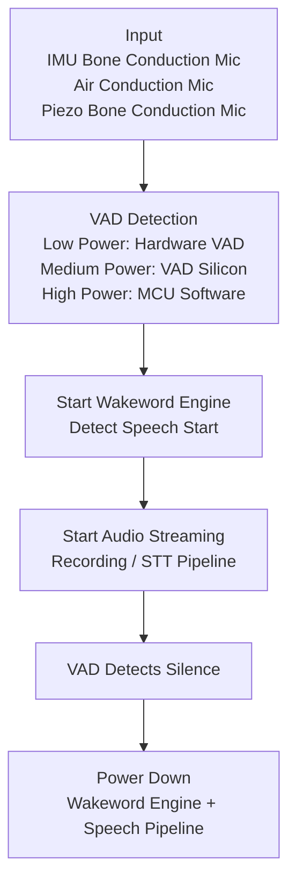
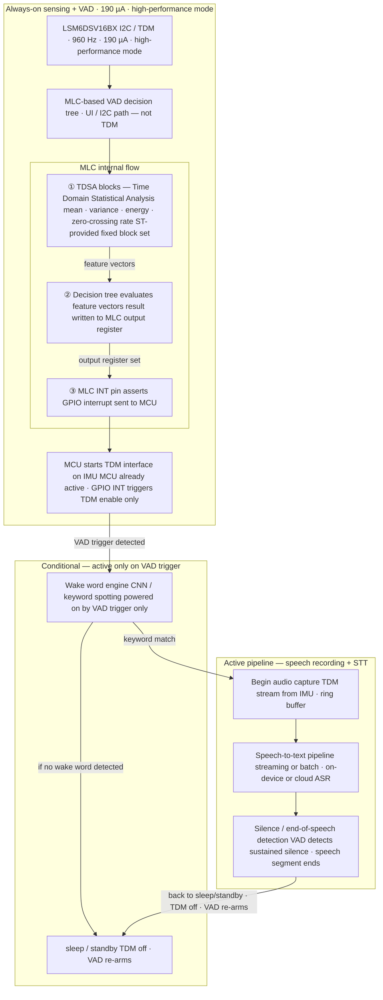

# Pipeline:

# Options:
- **MEMS Accelerometer-Only Solution** ODR up to 6.8kHz with hardware VAD support (same IMU used for bone conduction by openEarable) Package size: 1.2 × 0.8 × 0.55 mm → [BMA580 Datasheet](https://www.bosch-sensortec.com/media/boschsensortec/downloads/datasheets/bst-bma580-ds000.pdf)
- **VAD Chip** _(requires mic input via I2S or PDM, not TDM — doubles power draw: mic + VAD chip)_ → [NeuroVoice VAD Product Brief](https://polyn.ai/wp-content/uploads/2024/03/NeuroVoice-VAD-Product-Brief-v08-5.pdf)
- **Onboard VAD & `Wake Word` Microphones**
	1. [SISTC Smart MEMS Microphone](https://sistc.com/product/smart-mems-microphone/)
	2. [Knowles SmartMic — used in vivo NEX AI Smartphone](https://investor.knowles.com/news/news-details/2018/Vivo-Selects-Knowles-SmartMic-in-New-Flagship-vivo-NEX-AI-Smartphone-06-12-2018/default.aspx)
	3. [Knowles IA611 Datasheet](https://www.knowles.com/docs/default-source/default-document-library/zz_ia611-datasheet-2019-brochure.pdf?sfvrsn=fd4871b1_2)
### LSM6DSV16BX based solution

OR more visually appealing:

/IMU%20MLC%20VAD.png)