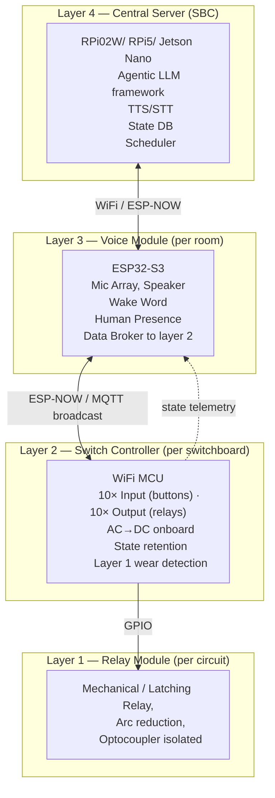

# Resources
**Reference Designs**
- [HeyWillow](https://heywillow.io/) (and [Willow Autocorrect](https://github.com/kovrom/willow-autocorrect) and [Willow Inference Server](https://github.com/toverainc/willow-inference-server))
- [ESPHome](https://esphome.io/)
- [Home Assistant](https://github.com/home-assistant/)
- [Tasmota](https://tasmota.github.io/docs/)
- [Rhasspy](https://rhasspy.readthedocs.io)

**AI agent design**
- [PicoClaw AI Assistant](https://github.com/sipeed/picoclaw)

**Wake Word Engines**
- [Porcupine](https://github.com/Picovoice/Porcupine)
- [ESP-SR / WakeNet](https://github.com/espressif/esp-sr)
- [DaVoice / Python Wake Word Detection](https://github.com/frymanofer/Python_WakeWordDetection)
- [hey-buddy](https://github.com/painebenjamin/hey-buddy)

**Voice Hardware References**
- [ReSpeaker XVF3800](https://wiki.seeedstudio.com/respeaker_xvf3800_introduction/)
- [ReSpeaker Lite (XIAO)](https://wiki.seeedstudio.com/xiao_respeaker/)
- [ESP32-S3 Box 3 Hardware](https://github.com/espressif/esp-box/tree/master/hardware)

**ESP Networking**
- [ESP-WiFi Mesh](https://docs.espressif.com/projects/esp-idf/en/stable/esp32s3/api-guides/esp-wifi-mesh.html)
- [ESP-BLE Mesh](https://docs.espressif.com/projects/esp-idf/en/stable/esp32s3/api-guides/esp-ble-mesh/ble-mesh-index.html)
- [ESP Protocols](https://docs.espressif.com/projects/esp-idf/en/stable/esp32s3/api-reference/protocols/index.html)
- [ESP Network](https://docs.espressif.com/projects/esp-idf/en/stable/esp32s3/api-reference/network/index.html)
- [ESP-CSI (presence detection)](https://github.com/espressif/esp-csi)
- [ESP-AFE audio processing](https://github.com/espressif/esp-sr/issues/79)
- OTS updates obvio
- WIFI FTM for determining best route to router?

**Competitors**
- [Sonoff](https://www.sonoff.in/) — most relevant, Chinese pricing
- [Shelly](https://www.shelly.com/)
- [Tuya](https://realestate.tuya.com/)
- Panasonic Roma Urban, Havells, Goldmedal, Legrand, Schneider, Wipro — all overpriced, ecosystem-locked
# Overview
A 4-layer hierarchical home automation system targeting cost below a smartphone. 
- **Layer 1** handles AC switching via relays. 
- **Layer 2** is a per-switchboard WiFi MCU aggregating relay control and physical buttons. 
- **Layer 3** is a per-room ESP32-S3 voice module with wake word detection, human presence sensing, and acts as a data broker between Layer 2 and Layer 4. 
- **Layer 4** is a central SBC (RPi/Jetson) running the agentic LLM pipeline, TTS/STT, intent recognition, state management, and configuration for all layers. Basic operation (button presses, scheduled tasks) works fully offline; cloud LLM used only for complex queries.
**Layer 5** is mobile devices for online remote control
# Architecture

## Layer 1 — Relay Module
### Relay Selection
Preferred: **Mechanical / Latching relay** for cost and low power. SSR ruled out for thermal overhead and leakage.
### Hardware Requirements
- Arc reduction circuitry (snubber / MOV) — mandatory for fire safety
- Automatic wear detection circuit — relay switch count tracking for replacement alerts
- Optocoupler isolation between MCU and AC side
- Load-type variants: resistive, inductive (motor, compressor), capacitive (dimmer)
- Variants: low power, medium power, high power, fan speed controller, active dimmers.
- Flame-resistant casing
- Target BOM: **<₹100/unit**
- Verify relay sourcing — heavily counterfeited; vet distributors
### Open Questions
- Electrical isolation requirement between Layer 1 and Layer 2 (Optocoupler?)
- Arc reduction design varies by load type (inductive, capacitive, resistive) — confirm per variant
## Layer 2 — Switch Controller MCU
### Hardware Requirements
- ~10 GPIO inputs (physical switch positions) + ~10 GPIO outputs (relay drive)
	- ~10 more GPIO input for final state checking from relay (again electrical isolation?)
	- Use MUX / IO expander if native GPIO is insufficient
- WiFi-capable MCU (minimal spec acceptable)
- Onboard AC→DC SMPS — powers itself and all Layer 1 modules on the same switchboard
	- Verify sourcing — same counterfeiting risk as Layer 1
- Last one win logic: relay state = network command **OR** physical button press whichever is latest
- State retention across power failures (NVM / EEPROM)
- mDNS configuration page for device setup → config pushed to Layer 3 which push to layer 4
- Target BOM: **<₹500/unit**
### Software
- Layer 3 broadcast input + button input → relay output with NVM state retention
- Layer 1 health monitoring (wear counter telemetry, final state check)
- Local scheduler for predefined tasks (e.g. geyser timer)
- mDNS config page
### Communication (to be decided — @rupak)
- Options: MQTT broadcast, ESP-NOW broadcast, direct WiFi
## Layer 3 — Voice Module
### Hardware Requirements
- ESP32-S3 (primary MCU, maybe ESPS3 box3)
- Mic array (reference: ReSpeaker XVF3800 or ReSpeaker Lite) and Speaker
- Human presence sensor: mmWave radar **or** [ESP-CSI (presence detection)](https://github.com/espressif/esp-csi) passive WiFi sensing
- Optional: camera, gesture recognition
- One unit per room
### Software
- Wake word: **"Hey Buddy"**
	- Engine options: Porcupine, ESP WakeNet, DaVoice
- VAD (Voice Activity Detection) to detect end-of-utterance and stop recording
- Voice strength / [RSSI detection](https://github.com/espressif/esp-sr/issues/79) — determines which room the command originates from → prevents cross-room control
- Audio stream to/from Layer 4 (post wake word only)
- Data broker: relays Layer 4 commands to Layer 2, Layer 2 telemetry to Layer 4
- Layer 2 health monitoring
### Communication (to be decided — @rupak)
- Layer 4 ↔ Layer 3: WiFi or ESP-NOW
- Layer 3 ↔ Layer 2: ESP-NOW preferred (keeps Layer 2 off main WiFi)
> [!important] Human Presence Logic
> Room voice module only accepts commands when presence is detected in **its own** room. If room is empty, any voice module can control it. Prevents "turn off Pratham's light" from Pinky's room while Pratham is in it.
## Layer 4 — Central Server
### Hardware Options

| SBC | Use Case |
|---|---|
| RPi Zero 2W | Minimal, cloud-LLM only |
| RPi 5 | Balanced, partial offline |
| Jetson Nano | Full offline inference |
Requirements: battery + power management, power brick, Ethernet, optional display.
### Software
- Receives audio stream from Layer 3, runs STT pipeline
- Intent recognition (offline, "sasta text-to-action") for simple commands — no LLM needed
- Agentic LLM: **Claude Haiku** (online) | offline TBD (@rupak)
- TTS output → streamed back to Layer 3 speaker
- System prompt locked to home assistant scope — no general queries
- State database: temporal log (time-series) + current static state
	- Enables queries like "turn that light back on" without LLM session management
	- Cyclic buffer option: retain only last few hours in active context
- Full configuration management for all Layer 1/2/3 devices
	- Which relay = which appliance
	- Which Layer 2 = which relays
	- Which Layer 3 = which Layer 2 modules
- Health monitoring for all layers
> [!note] Offline vs Online Split
> Simple commands (on/off, schedule) → local intent engine, no internet required
> Complex / ambiguous queries → Claude Haiku via API
> System must be **fully functional with WiFi down** for all basic controls
## Design Principles
- **Buttons always work** — physical button input bypasses all network/MCU dependency; passive state-preserving circuit logic as fallback
- **For the love of engineering: No ecosystem lock-in** — open protocols, add your devices
- **Future protocol exploration**: Matter, Thread
- Optional opt-in: record voice data in production for custom wake word model training

---

## Market & Business
### Competitive Landscape

| Player                                                                                                                                                                                                                                                                                                                                                                                                                                   | Notes                                             |
| ---------------------------------------------------------------------------------------------------------------------------------------------------------------------------------------------------------------------------------------------------------------------------------------------------------------------------------------------------------------------------------------------------------------------------------------- | ------------------------------------------------- |
| [Sonoff](https://www.sonoff.in/)                                                                                                                                                                                                                                                                                                                                                                                                         | Primary threat — Chinese pricing, strong software |
| [Shelly](https://www.shelly.com/)                                                                                                                                                                                                                                                                                                                                                                                                        | European, solid hardware                          |
| [Tuya](https://realestate.tuya.com/)                                                                                                                                                                                                                                                                                                                                                                                                     | Platform play, ecosystem heavy                    |
| [Panasonic](https://lsin.panasonic.com/smart-homes-and-buildings/residential/roma-urban-smart-switches) / [Havells](https://havells.com/reo/green-energy/smart-home/smart-modular-switches.html) / [Legrand](https://www.legrand.co.in/products/kg8013-living-now-voice-a-d) / [Schneider](https://eshop.se.com/in/smart-homes-package.html) / [Wipro](https://www.wiproconsumerlighting.com/products/smart-home/smart-home-accessories) | Overpriced, dumb design, ecosystem-locked         |
| [Goldmedal](https://www.switchofy.com/product/goldmedal-i-touch-wifi-panel-home-automation/) / [Switchofy](https://www.switchofy.com/product/goldmedal-i-touch-wifi-panel-home-automation/)                                                                                                                                                                                                                                              | Low-end smart switches only                       |
### Likely Future Entrants (once market validates)
- Consumer electronics: Noise, boAt, Mivi, Zebronics, Portronics — hardware/software both
- Home Appliance brands — natural ecosystem extension
- All those overprices dumb design brands (electrical manufacturers)
- Smartphone brands — full ecosystem play (most dangerous long-term)
### Target Customers

| Segment        | Notes                                      |
| -------------- | ------------------------------------------ |
| Promotors      | Influencers                                |
| Early adopters | Enthusiasts                                |
| Primary B2B    | Real estate developers — bulk, pre-install |
| Secondary B2C  | Individual apartment owners                |
**Pitch**: Smart home cheaper than your smartphone.