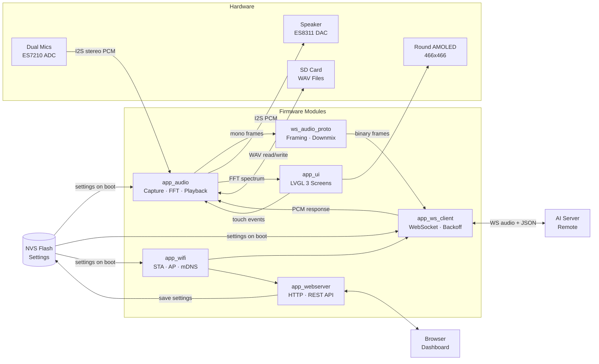
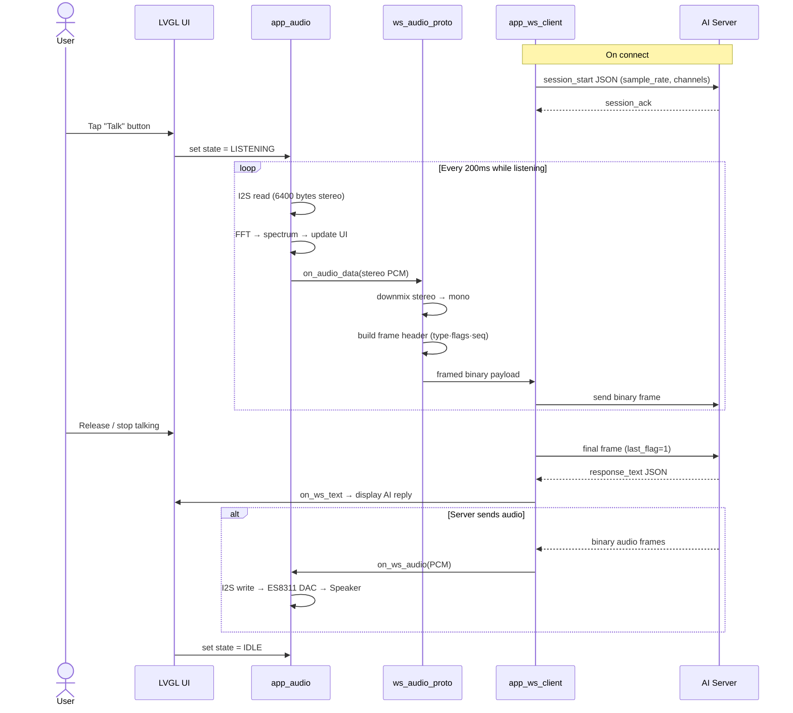

## Diagram 1 — System Architecture

```mermaid

flowchart LR

NVS[(NVS Flash\nSettings)]

  

subgraph HW [Hardware]

MIC[Dual Mics\nES7210 ADC]

SPK[Speaker\nES8311 DAC]

SD[SD Card\nWAV Files]

DISP[Round AMOLED\n466x466]

end

  

subgraph FW [Firmware Modules]

AUDIO[app_audio\nCapture · FFT · Playback]

PROTO[ws_audio_proto\nFraming · Downmix]

WS[app_ws_client\nWebSocket · Backoff]

WIFI[app_wifi\nSTA · AP · mDNS]

UI[app_ui\nLVGL 3 Screens]

WEB[app_webserver\nHTTP · REST API]

end

  

AI[AI Server\nRemote]

BROWSER[Browser\nDashboard]

  

MIC -->|I2S stereo PCM| AUDIO

AUDIO -->|mono frames| PROTO

PROTO -->|binary frames| WS

WS <-->|WS audio + JSON| AI

WS -->|PCM response| AUDIO

AUDIO -->|I2S PCM| SPK

AUDIO -->|FFT spectrum| UI

AUDIO <-->|WAV read/write| SD

UI --> DISP

WIFI --> WS

WIFI --> WEB

WEB <--> BROWSER

NVS -->|settings on boot| AUDIO

NVS -->|settings on boot| WS

NVS -->|settings on boot| WIFI

WEB -->|save settings| NVS

UI -->|touch events| AUDIO

```
## Diagram 2 — Voice Interaction Flow

```mermaid

sequenceDiagram

actor User

participant UI as LVGL UI

participant Audio as app_audio

participant Proto as ws_audio_proto

participant WS as app_ws_client

participant AI as AI Server

  

Note over WS,AI: On connect

WS->>AI: session_start JSON (sample_rate, channels)

AI-->>WS: session_ack

  

User->>UI: Tap "Talk" button

UI->>Audio: set state = LISTENING

  

loop Every 200ms while listening

Audio->>Audio: I2S read (6400 bytes stereo)

Audio->>Audio: FFT → spectrum → update UI

Audio->>Proto: on_audio_data(stereo PCM)

Proto->>Proto: downmix stereo → mono

Proto->>Proto: build frame header (type·flags·seq)

Proto->>WS: framed binary payload

WS->>AI: send binary frame

end

  

User->>UI: Release / stop talking

WS->>AI: final frame (last_flag=1)

  

AI-->>WS: response_text JSON

WS->>UI: on_ws_text → display AI reply

  

alt Server sends audio

AI-->>WS: binary audio frames

WS->>Audio: on_ws_audio(PCM)

Audio->>Audio: I2S write → ES8311 DAC → Speaker

end

  

UI->>Audio: set state = IDLE

```