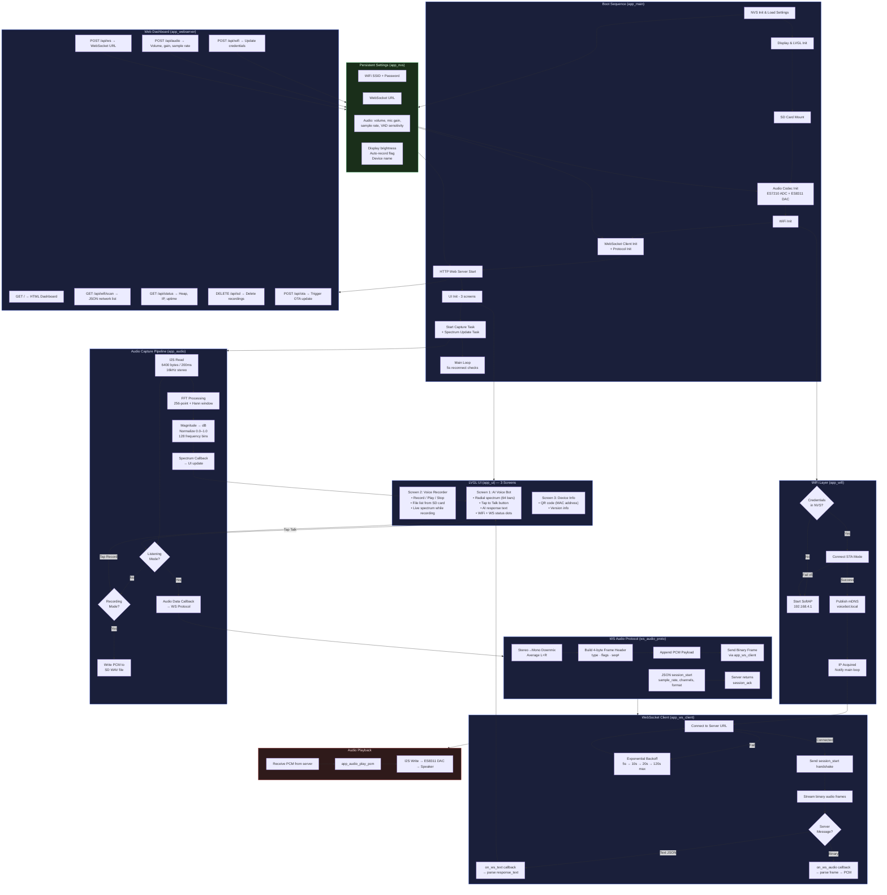

```mermaid

flowchart TD

subgraph Boot ["Boot Sequence (app_main)"]

A[NVS Init & Load Settings] --> B[Display & LVGL Init]

B --> C[SD Card Mount]

C --> D[Audio Codec Init\nES7210 ADC + ES8311 DAC]

D --> E[WiFi Init]

E --> F[WebSocket Client Init\n+ Protocol Init]

F --> G[HTTP Web Server Start]

G --> H[UI Init - 3 screens]

H --> I[Start Capture Task\n+ Spectrum Update Task]

I --> J[Main Loop\n5s reconnect checks]

end

  

subgraph WiFi ["WiFi Layer (app_wifi)"]

W1{Credentials\nin NVS?} -->|Yes| W2[Connect STA Mode]

W1 -->|No| W3[Start SoftAP\n192.168.4.1]

W2 -->|Success| W4[Publish mDNS\nvoicebot.local]

W2 -->|Fail x5| W3

W4 --> W5[IP Acquired\nNotify main loop]

end

  

subgraph AudioCapture ["Audio Capture Pipeline (app_audio)"]

AC1[I2S Read\n6400 bytes / 200ms\n16kHz stereo] --> AC2[FFT Processing\n256-point + Hann window]

AC2 --> AC3[Magnitude → dB\nNormalize 0.0–1.0\n128 frequency bins]

AC3 --> AC4[Spectrum Callback\n→ UI update]

AC1 --> AC5{Listening\nMode?}

AC5 -->|Yes| AC6[Audio Data Callback\n→ WS Protocol]

AC5 -->|No| AC7{Recording\nMode?}

AC7 -->|Yes| AC8[Write PCM to\nSD WAV file]

end

  

subgraph WSProto ["WS Audio Protocol (ws_audio_proto)"]

P1[Stereo→Mono Downmix\nAverage L+R] --> P2["Build 4-byte Frame Header\ntype · flags · seq#"]

P2 --> P3[Append PCM Payload]

P3 --> P4[Send Binary Frame\nvia app_ws_client]

P5[JSON session_start\nsample_rate, channels, format] --> P6[Server returns\nsession_ack]

end

  

subgraph WSClient ["WebSocket Client (app_ws_client)"]

WS1[Connect to Server URL] -->|Connected| WS2[Send session_start handshake]

WS2 --> WS3[Stream binary audio frames]

WS3 --> WS4{Server\nMessage?}

WS4 -->|Text JSON| WS5[on_ws_text callback\n→ parse response_text]

WS4 -->|Binary| WS6[on_ws_audio callback\n→ parse frame → PCM]

WS1 -->|Fail| WS7[Exponential Backoff\n5s → 10s → 20s → 120s max]

WS7 --> WS1

end

  

subgraph Playback ["Audio Playback"]

PB1[Receive PCM from server] --> PB2[app_audio_play_pcm]

PB2 --> PB3[I2S Write → ES8311 DAC → Speaker]

end

  

subgraph UI ["LVGL UI (app_ui) — 3 Screens"]

UI1["Screen 1: AI Voice Bot\n• Radial spectrum (64 bars)\n• Tap to Talk button\n• AI response text\n• WiFi + WS status dots"]

UI2["Screen 2: Voice Recorder\n• Record / Play / Stop\n• File list from SD card\n• Live spectrum while recording"]

UI3["Screen 3: Device Info\n• QR code (MAC address)\n• Version info"]

end

  

subgraph WebDash ["Web Dashboard (app_webserver)"]

WD1["GET / → HTML Dashboard"]

WD2["POST /api/wifi → Update credentials"]

WD3["GET /api/wifi/scan → JSON network list"]

WD4["POST /api/audio → Volume, gain, sample rate"]

WD5["POST /api/ws → WebSocket URL"]

WD6["GET /api/status → Heap, IP, uptime"]

WD7["DELETE /api/sd → Delete recordings"]

WD8["POST /api/ota → Trigger OTA update"]

end

  

subgraph NVS ["Persistent Settings (app_nvs)"]

NV1["WiFi SSID + Password"]

NV2["WebSocket URL"]

NV3["Audio: volume, mic gain,\nsample rate, VAD sensitivity"]

NV4["Display brightness\nAuto-record flag\nDevice name"]

end

  

%% Main connections

E --> WiFi

I --> AudioCapture

AC6 --> WSProto

WSProto --> WSClient

WSClient --> Playback

WS5 --> UI1

AC4 --> UI1

H --> UI

G --> WebDash

WD2 & WD4 & WD5 --> NVS

A --> NVS

NVS --> D

NVS --> F

NVS --> G

  

%% Touch interactions

UI1 -->|Tap Talk| AC5

UI2 -->|Tap Record| AC7

  

%% WiFi to WS

W5 --> WS1

  

%% Style

classDef module fill:#1a1f3a,stroke:#5577ff,color:#e0e6ff

classDef data fill:#1a2f1a,stroke:#44cc77,color:#e0ffe6

classDef hw fill:#2f1a1a,stroke:#cc4444,color:#ffe0e0

class Boot,WiFi,AudioCapture,WSProto,WSClient,WebDash,UI module

class NVS data

class Playback hw

```