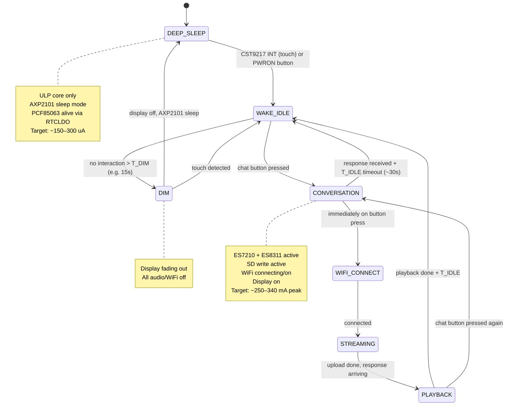

# Resources
- [Waveshare Wiki – ESP32-S3-Touch-AMOLED-1.75](https://www.waveshare.com/wiki/ESP32-S3-Touch-AMOLED-1.75)
- [AXP2101 Datasheet](AXP2101.pdf)
- [ES7210 Datasheet](ES7210.pdf)
- [ES8311 Datasheet](ES8311.pdf)

---

# Hardware Overview

**Module:** ESP32-S3-Touch-AMOLED-1.75 (Waveshare)
**Purpose:** Voice assistant bot — records audio, streams to AI backend over WiFi, plays back response, logs conversation to SD.

## IC Map

| IC | Function | Interface | I2C Addr | Key GPIOs |
|---|---|---|---|---|
| ESP32-S3R8 | SoC, dual-core LX7 @ 240MHz, 8MB PSRAM, 16MB Flash | — | — | — |
| AXP2101 | PMU: 4× DCDC + 11× LDO + charger + E-Gauge | TWSI (I2C) | 0x34 | SDA=GPIO15, SCL=GPIO14 |
| CO5300 | 1.75" AMOLED 466×466 display driver | QSPI | — | DATA0–3=GPIO4–7, SCLK=GPIO38, CS=GPIO12, RST=GPIO39 |
| CST9217 | Capacitive touch controller | I2C | **0x5A** | INT=GPIO11, RST=GPIO40 |
| ES7210 | 4-ch mic ADC, 24-bit, echo cancellation | I2S + I2C | 0x40–0x43 | shared I2S bus |
| ES8311 | Mono audio CODEC (ADC+DAC), 24-bit | I2S + I2C | **0x18** (CE=GND) | shared I2S bus |
| QMI8658 | 6-axis IMU (accel + gyro) | I2C | — | SDA=GPIO15, SCL=GPIO14 |
| TCA9554 | 8-bit GPIO expander | I2C | — | SDA=GPIO15, SCL=GPIO14 |
| PCF85063 | RTC | I2C | — | Powered by AXP2101 RTCLDO; survives deep sleep |
| SD card | Storage | SPI | — | CS=GPIO41, CMD/MOSI=GPIO1, DATA0/MISO=GPIO3, CLK=GPIO2 |

> [!note] Shared I2C bus
> SDA=GPIO15, SCL=GPIO14 is used by AXP2101, CST9217, ES7210, ES8311, QMI8658, TCA9554, PCF85063.

## GPIO Pin Map

| Signal | GPIO | Direction | Notes |
|---|---|---|---|
| LCD QSPI DATA0 | 4 | OUT | CO5300 |
| LCD QSPI DATA1 | 5 | OUT | CO5300 |
| LCD QSPI DATA2 | 6 | OUT | CO5300 |
| LCD QSPI DATA3 | 7 | OUT | CO5300 |
| LCD SCLK | 38 | OUT | CO5300 |
| LCD CS | 12 | OUT | CO5300 |
| LCD RST | 39 | OUT | CO5300 |
| I2C SDA | 15 | BIDIR | Shared bus — all I2C ICs |
| I2C SCL | 14 | OUT | Shared bus — all I2C ICs |
| Touch INT | 11 | IN | CST9217, active-low; ext1 wakeup source |
| Touch RST | 40 | OUT | CST9217 |
| I2S MCLK | 42 | OUT | To ES7210 + ES8311 |
| I2S BCLK | 9 | OUT | To ES7210 + ES8311 |
| I2S WS/LRCK | 45 | OUT | To ES7210 + ES8311 |
| I2S DOUT | 10 | OUT | ESP32→ES8311 (DAC) |
| I2S DIN | 8 | IN | ES7210→ESP32 (ADC) |
| PA enable | 46 | OUT | Speaker amp enable, active HIGH; drive LOW when speaker off |
| SD CLK | 2 | OUT | |
| SD CMD | 1 | OUT | MOSI in SPI mode |
| SD DATA0 | 3 | IN | MISO in SPI mode |
| SD CS | 41 | OUT | |

---

# Power States

## State Machine



## Power Budget by State

| Component | Deep Sleep | Sleep Mode / Method | Wake/Idle | Conversation |
|---|---|---|---|---|
| ESP32-S3 ULP only | ~25 µA | `esp_deep_sleep_start()` | — | — |
| ESP32-S3 active (no WiFi) | — | — | ~80 mA | ~80 mA |
| ESP32-S3 WiFi TX active | — | — | — | ~130–160 mA |
| CO5300 (AMOLED driver IC) | **~100–300 µA** ⚠️ | SLPIN `0x10` via QSPI — panel off, IC quiescent with VDD on | ~30–50 mA | ~30–50 mA |
| ES7210 (mic ADC) | 0 µA | ALDO1 off (no VDD) | 0 | ~19 mA |
| ES8311 (codec) | **~50–200 µA** ⚠️ | Register power-down; DVDD quiescent unavoidable with VCC3V3 on | 0 | ~8 mA |
| SD card | **~100–200 µA** ⚠️ | CS deasserted (GPIO41 HIGH); CMD3 sleep unavailable in SPI mode | 0 | ~30 mA |
| SPI flash | ~1 µA | Deep power-down `0xB9`; auto by ESP-IDF before deep sleep | — | — |
| CST9217 touch | ~5 µA | **Must stay active** — wakeup source, monitors touch at low rate | ~1 mA | ~1 mA |
| QMI8658 IMU | ~10 µA | I2C sleep reg `CTRL1[1]=0` | ~1 mA | ~1 mA |
| TCA9554 GPIO expander | ~5 µA | No sleep mode; outputs latch, quiescent from VCC only | — | — |
| PCF85063 RTC | ~0.5 µA | Powered by RTCLDO (independent of DCDC1) | ~0.5 µA | ~0.5 µA |
| AXP2101 quiescent | ~40 µA | Only DCDC1 + RTCLDO active | ~5 mA | ~5 mA |
| Speaker PA | ~0 µA | GPIO46 LOW → hard shutdown | — | — |
| **Total estimated** | **~340–790 µA** | | **~120–140 mA** | **~270–345 mA** |

> [!caution] Deep sleep dominated by CO5300 and SD card — both on VCC3V3 with no power cut path
> CO5300 driver IC quiescent with VDD applied in SLPIN is the largest unknown — measure empirically with ammeter on VSYS. SD card SPI idle ~100–200 µA is a fixed cost. Neither can be eliminated without a board-level hardware mod to route them through a switchable rail.

> [!note] ES8311 power-down measurement needed
> Datasheet "0 µA" refers to the signal path (DAC/ADC off). Digital core and I2C slave remain clocked from DVDD. Actual quiescent ~50–200 µA — measure before assuming best case.

> [!caution] WiFi peak current
> WiFi TX bursts can hit 350–500 mA instantaneously. The battery + AXP2101 BATFET (50mΩ) + bulk capacitance on VSYS must handle this. AXP2101 ISYS max = 2A — fine, but keep battery lead resistance in mind.

---

# AXP2101 Power Management

## Rail Strategy

| AXP2101 Rail | Type | V Range | Imax | Board Assignment | Deep Sleep Target |
|---|---|---|---|---|---|
| DCDC1 (VCC3V3) | Buck | 1.5–3.4V @ 3.3V | 2A | ESP32-S3R8, CO5300, CST9217, ES8311, QMI8658, TCA9554, SD card, SPI flash, buttons, speaker PA | **Keep ON** — powers SoC ULP domain |
| DCDC2 | Buck | 0.5–1.54V | 2A | **unused** | Disable |
| DCDC3 | Buck | 0.5–1.54V | 2A | **unused** | Disable |
| DCDC4 | Buck | 0.5–1.84V | 1.5A | **unused** | Disable |
| ALDO1 (A3V3) | LDO | 0.5–3.5V @ 3.3V | 300mA | **ES7210** (mic ADC only) | **Disable** in deep sleep |
| ALDO2–4 | LDO | 0.5–3.5V | 300mA ea | **unused** | Disable |
| BLDO1–2 | LDO | 0.5–3.5V | 300mA ea | **unused** | Disable |
| DLDO1/DC1SW | Switch/LDO | 0.5–3.3V | 300mA | **unused** | Disable |
| CPUSLDO | LDO | 0.5–1.4V | 30mA | CPU supply reference | Off in deep sleep |
| RTCLDO1/2 (VCC-RTC) | LDO | fixed | 30mA | **PCF85063 RTC** | **Always on** |

## Sleep / Wakeup Procedure

AXP2101 sleep is not a hardware pin — it is register-controlled via TWSI (XPowersLib wraps all register access).

**Entering sleep:**
```cpp
// 1. Disable non-essential rails
PMU.disableALDO1();   // A3V3 → ES7210
PMU.disableALDO2();   // unused
PMU.disableALDO3();   // unused
PMU.disableALDO4();   // unused
PMU.disableBLDO1();   // unused
PMU.disableBLDO2();   // unused
PMU.disableDC2();     // unused
PMU.disableDC3();     // unused
PMU.disableDC4();     // unused
PMU.disableDLDO1();   // unused, unconnected
// DCDC1 (VCC3V3) must remain ON — powers SoC, flash, ULP domain

// 2. Configure wakeup source
PMU.wakeupControl(XPOWERS_AXP2101_WAKEUP_IRQ_PIN_TO_LOW, true);   // IRQ pin low → wake PMU
PMU.wakeupControl(XPOWERS_AXP2101_WAKEUP_PWROK_TO_LOW, true);     // PWRON key → wake PMU

// 3. Enable sleep (REG26H[0]=1) — records current rail config
PMU.enableSleep();

// 4. Then: esp_deep_sleep_start()
// AXP2101 total draw drops to ~40uA with only RTCLDO active
```

**Waking up:**
```cpp
// In deep sleep wakeup stub (RTC fast memory):
// ESP32-S3 wakes via ext1 on GPIO11 (CST9217 INT, active-low)
// Then re-enable rails via I2C before full app boot

PMU.enableWakeup();   // REG26H[1]=1 — SW wakeup (not needed for GPIO-triggered wake)
// Re-enable each rail in the same order as init
```

> [!important] Wakeup path
> CST9217 INT → GPIO11 → ESP32-S3 **ext1** wakeup (not ext0; ext0 is single-pin only, ext1 supports multiple pins or use GPIO wakeup in ULP). ESP32-S3 wakes first, re-enables AXP2101 rails via I2C, then boots application. AXP2101 IRQ wakeup path is not needed.

**Full shutdown (cuts all power except VRTC):**
```cpp
PMU.shutdown();   // REG10H[0]=1 — unrecoverable until PWRON key
```

**Fast wakeup (reduces wakeup time from sleep):**
```cpp
PMU.enableFastWakeup();
PMU.disableFastWakeup();
```

## Key Registers (XPowersLib Reference)

| XPowersLib Call | Register | Function |
|---|---|---|
| `PMU.enableSleep()` | REG26H[0]=1 | Records config, enters sleep |
| `PMU.enableWakeup()` | REG26H[1]=1 | SW wakeup trigger |
| `PMU.wakeupControl(IRQ_PIN_TO_LOW, true)` | REG26H[4]=1 | IRQ pin low → wakeup |
| `PMU.wakeupControl(PWROK_TO_LOW, true)` | REG26H | PWRON key → wakeup |
| `PMU.shutdown()` | REG10H[0]=1 | All power off except VRTC |
| `PMU.disableBLDO1/2()` | REG90H | Audio rail disable |
| `PMU.disableALDO1/2/3/4()` | REG90H–91H | Peripheral rail disable |
| `PMU.disableDC2/3/4()` | REG80H | DCDC rail disable |
| `PMU.enableFastWakeup()` | REG26H | Reduce wakeup time |
| — | 0x62 | ICHG: fast charge current (default 300mA, max 1500mA) |
| — | 0x30 | ADC enable: BAT/VBUS/VSYS/TS/temp |
| — | 0xA2 | E-Gauge enable/disable |

---

# ES7210 — Mic ADC Power Control

| Mode | VDDD | VDDP | VDDA | Current |
|---|---|---|---|---|
| Normal (Fs=16kHz) | 1.8V | 1.8V | 3.3V | ~19mA (63mW) |
| Normal (all 1.8V) | 1.8V | 1.8V | 1.8V | ~13mA (24mW) |
| Power Down | 1.8V | 1.8V | 3.3V | **10 uA** |

- Power down via I2C register write (internal register, see ES7210 user guide for reg map)
- Alternatively: cut VDDA/VDDD via AXP2101 BLDO → 0uA, but requires re-init on wakeup
- Only activate during CONVERSATION state, immediately before mic capture starts

> [!note] Startup latency
> ES7210 requires MCLK, LRCK, SCLK stable before I2C config, or reset after clocks arrive. Budget ~10ms for stable audio after power-on.

---

# ES8311 — Codec Power Control

| Mode | DVDD | PVDD | AVDD | Current |
|---|---|---|---|---|
| Normal (playback+record) | 1.8V | 1.8V | 3.3V | **8 mA** |
| Power Down (register) | 1.8V | 1.8V | 3.3V | **0 uA** |

- ES8311 Note 4: power all supplies on first, then enter low power via register, then stop MCLK. Reverse on wakeup.
- I2C address: `0x18` (CE=GND, confirmed `ES8311_ADDRRES_0`)
- DAC path only needed during PLAYBACK; ADC path only if using ES8311 mic input (board uses ES7210 for mics, so ES8311 ADC may be unused entirely)
- ES8311 AVDD sourced from VCC3V3 (DCDC1) — cannot be cut independently. Use register power-down for near-0 draw; DCDC1 must stay on for SoC.

## Speaker PA — GPIO 46

> [!caution] GPIO 46 controls speaker amp enable directly — NOT via AXP2101
> This is a raw GPIO, not a PMU rail. Must be explicitly driven.

| State | GPIO 46 | Effect |
|---|---|---|
| Speaker active | HIGH | Amp enabled |
| Speaker off / deep sleep | **LOW** | Amp disabled — prevents idle current and pop noise |

- Drive LOW before entering any sleep state
- Drive HIGH only immediately before starting audio playback
- Do not leave floating — amp behavior with floating enable is undefined

---

# Implementation Strategy

## First Boot Checklist

> [!important] Confirmed rails
> - **DCDC1 (VCC3V3)**: powers ESP32-S3, display, touch, ES8311, IMU, GPIO expander, SD, SPI flash, speaker PA — **never disable**
> - **ALDO1 (A3V3)**: ES7210 only — safe to disable in deep sleep
> - **RTCLDO (VCC-RTC)**: PCF85063 — always on

> [!note] All rails fully mapped
> Every AXP2101 rail is accounted for. Only DCDC1 (VCC3V3) and RTCLDO are active in operation. ALDO1 (A3V3) is active only during CONVERSATION. All other rails (DCDC2–4, ALDO2–4, BLDO1–2, DLDO1/DC1SW) are unused and unconnected — disable unconditionally at init.

> [!caution] AXP2101 OTP defaults may leave unused rails enabled at boot
> Call all `PMU.disableXxx()` for unused rails explicitly during `app_main()` init, not just in the sleep sequence.

## DEEP_SLEEP Entry Sequence

```
1. GPIO46 LOW → speaker amp disabled
2. Fade display brightness → CO5300 SLPIN (0x10) command via QSPI
3. ES8311: power-down register → stop MCLK (GPIO42 LOW)
4. ES7210: power-down register
5. Close SD transaction, GPIO41 HIGH (SD CS deasserted)
6. QMI8658: write sleep register via I2C
7. WiFi: esp_wifi_stop() → esp_wifi_deinit()
8. AXP2101 (XPowersLib):
   PMU.disableALDO1()   ← A3V3 → ES7210
   PMU.disableALDO2()   ← unused
   PMU.disableALDO3()   ← unused
   PMU.disableALDO4()   ← unused
   PMU.disableBLDO1()   ← unused
   PMU.disableBLDO2()   ← unused
   PMU.disableDC2()     ← unused
   PMU.disableDC3()     ← unused
   PMU.disableDC4()     ← unused
   PMU.disableDLDO1()   ← unused, unconnected
   // DCDC1 (VCC3V3) stays ON
   PMU.wakeupControl(XPOWERS_AXP2101_WAKEUP_IRQ_PIN_TO_LOW, true)
   PMU.enableSleep()
9. esp_sleep_enable_ext1_wakeup(1ULL << 11, ESP_EXT1_WAKEUP_ALL_LOW)
   // GPIO11 = CST9217 INT, active-low
   // ext1 used (not ext0) — supports multi-pin and works with ULP
10. esp_deep_sleep_start()
```

> [!caution] ext1 vs ext0 wakeup
> ext0 supports only a single GPIO and requires RTC IO. ext1 supports multiple RTC-capable GPIOs — use ext1 for GPIO11 (CST9217 INT). Verify GPIO11 is RTC-capable in ESP32-S3 TRM; if not, use `esp_sleep_enable_gpio_wakeup()` via ULP.

## WAKE Entry Sequence

```
1. ESP32-S3 exits deep sleep → runs from RTC fast memory stub
2. I2C init (GPIO15/14) → AXP2101: re-enable rails
   PMU.enableDC2/3/4()      ← unused, but re-enable for clean state if needed
   PMU.enableALDO2/3/4()    ← unused
   PMU.enableBLDO1/2()      ← unused
   // PMU.enableALDO1() deferred — only in CONVERSATION entry, not WAKE_IDLE
3. Wait PWROK / rail settling (~5ms)
4. CO5300: SLPOUT (0x11) + reinit → restore last display content
5. CST9217: re-init if needed
6. QMI8658: wake from sleep
7. Show WAKE_IDLE UI
```

## CONVERSATION Entry Sequence

```
1. AXP2101: PMU.enableALDO1() → A3V3 → ES7210 VDDA/VDDD (confirmed)
   // ES8311 AVDD sourced from VCC3V3 (DCDC1) — always on, no enable needed
2. Enable MCLK output (GPIO42) from ESP32-S3 to both codecs
3. ES8311 init: provide clocks → configure via I2C (addr 0x18) → enable DAC path
4. ES7210 init: provide clocks → configure via I2C (addr 0x40) → enable mic channels
5. GPIO46 HIGH → speaker amp enabled (only when playback needed)
6. Start WiFi (esp_wifi_start) in parallel with step 4 — overlap connection latency with codec init
7. Mount SD filesystem (CS=GPIO41)
8. Begin I2S DMA capture → simultaneously write to SD and stream to WiFi socket
```

## WiFi Power Optimization

- Use `WIFI_PS_MIN_MODEM` (DTIM-based power save) during WAKE_IDLE if WiFi stays connected
- During active streaming: `WIFI_PS_NONE` for minimum latency
- Keep WiFi connected for T_KEEPALIVE (~30s) after last audio exchange before `esp_wifi_stop()`
- On reconnect: store AP credentials + last channel in RTC_DATA_ATTR to skip full scan

```c
// Store in RTC memory — survives deep sleep
RTC_DATA_ATTR uint8_t last_wifi_channel;
RTC_DATA_ATTR uint8_t last_bssid[6];
// Use esp_wifi_set_config() with bssid_set=true to skip scan
```

## Display Optimization

- CO5300 via QSPI: send `SLPIN` (0x10) command before deep sleep, `SLPOUT` (0x11) on wake
- AMOLED: black pixels draw ~0 current — show black background in WAKE_IDLE when possible
- Dim to minimum brightness after T_DIM before full sleep
- Use LEDC PWM on backlight if board has separate backlight circuit; CO5300 AMOLED is self-emissive — brightness via CO5300 WRCTRLD register

## Conversation Context Across Sleep

Two options:

| Option | Behaviour | Tradeoff |
|---|---|---|
| **Forget on sleep** | New conversation ID every wake | Simplest, minimal RTC RAM usage |
| **Continue conversation** | Store last `conversation_id` in `RTC_DATA_ATTR` | Need backend to keep session alive; add "New / Continue" prompt on wake |

Recommended: store `conversation_id` in RTC RAM. On wake, show option to continue or start new. If user takes no action within T_CHOICE (~5s), default to continue (or new — configurable).

```c
RTC_DATA_ATTR char last_conversation_id[37]; // UUID string
RTC_DATA_ATTR uint32_t last_activity_timestamp;
```

---

# Server Notifications During Sleep

## Delivery Options

### Option A — PCF85063 RTC Alarm (time-based only)

For reminders, scheduled alerts, alarms set by the user or server.

```
Server sends notification with timestamp
→ Device stores alarm time in PCF85063 via I2C before sleeping
→ PCF85063 fires IRQ at exact time → wakes ESP32
→ No WiFi needed during sleep
```

- Deep sleep current: unchanged
- Latency: exact
- Limitation: server must push alarm time *before* device sleeps; cannot deliver unscheduled push events

> [!important] PCF85063 IRQ → ESP32-S3 wakeup pin unverified
> RTC alarm IRQ pin must route to an RTC-capable GPIO for ext1 wakeup. Verify the Waveshare board connects this pin — not currently documented. If unconnected, Option A is blocked.

---

### Option B — Periodic Wake + Poll (unscheduled server push, latency-tolerant)

For message notifications, alerts where N-minute delay is acceptable.

```
Deep sleep → esp_sleep_enable_timer_wakeup every N minutes
→ connect WiFi (~0.5s with cached BSSID/channel, ~3s cold)
→ HTTP GET /notifications
→ if pending: show notification, optionally play chime
→ disconnect WiFi → back to deep sleep
```

Average current over a poll cycle:

$$I_{avg} = \frac{I_{sleep} \cdot T_{sleep} + I_{active} \cdot T_{active}}{T_{cycle}}$$

| Poll Interval | $T_{active}$ | $I_{avg}$ |
|---|---|---|
| 1 min | ~3s | ~10.4 mA |
| 5 min | ~3s | ~2.4 mA |
| 15 min | ~3s | ~1.1 mA |
| 30 min | ~3s | ~0.73 mA |

> [!note] WiFi reconnect optimization
> Cache last AP channel + BSSID in `RTC_DATA_ATTR` — cuts reconnect from ~3s to ~0.5s, meaningfully improves average current at short poll intervals.

```c
RTC_DATA_ATTR uint8_t last_wifi_channel;
RTC_DATA_ATTR uint8_t last_bssid[6];
```

---

### Option C — Light Sleep + WiFi Modem Sleep (real-time push)

For sub-second notification delivery. Never enters deep sleep while notifications are expected.

```
Light sleep between events
→ WiFi DTIM power save — radio wakes each beacon to check for data
→ Server pushes via MQTT or WebSocket keep-alive
```

| DTIM Interval | $I_{avg}$ | Notification latency |
|---|---|---|
| DTIM=1 (~102ms) | ~3–5 mA | ~100ms |
| DTIM=3 (~307ms) | ~1.5–3 mA | ~300ms |
| DTIM=10 (~1024ms) | ~0.8–1.5 mA | ~1s |

```c
esp_wifi_set_ps(WIFI_PS_MIN_MODEM);   // DTIM=1
esp_wifi_set_ps(WIFI_PS_MAX_MODEM);   // DTIM=10
```

> [!caution] Option C is light sleep, not deep sleep
> All VCC3V3 ICs remain powered and drawing quiescent current. Display must be in SLPIN. Total system current ~2–6 mA — ~5–15× worse than deep sleep + poll.

---

## Decision Framework

```mermaid
flowchart TD
    A[Notification type?] --> B[Time-based\nreminder / alarm]
    A --> C[Server push\nunscheduled]

    B --> D[PCF85063 RTC alarm → Option A\nDeep sleep untouched]

    C --> E[Latency tolerance?]
    E --> F[Minutes OK] --> G[Periodic wake + poll → Option B\n~1–3 mA avg at 5–15 min]
    E --> H[Sub-second needed] --> I[Light sleep + MQTT → Option C\n~2–5 mA continuous]
```



## Recommended Strategy

| Notification Class | Delivery | Sleep State |
|---|---|---|
| Reminder / alarm (user-set or server-scheduled) | PCF85063 alarm IRQ → ext1 wakeup | Deep sleep, no WiFi |
| Server push (message, unscheduled alert) | Timer wakeup + poll every 5–15 min | Deep sleep + timer |
| Real-time (requires instant delivery) | Light sleep + DTIM + MQTT | Light sleep only |

Default recommendation: **Option A + B hybrid**. Server converts any time-based events to PCF85063 alarm timestamps before device sleeps. Unscheduled push uses 5–15 min poll. Option C only if a genuine real-time requirement exists.

---

# Things Not Yet Addressed

- **QMI8658 motion wakeup**: accelerometer can generate interrupt on tap/double-tap → wire to ESP32-S3 GPIO as secondary wake source. Useful for wrist-raise wake.
- **PCF85063 alarm wakeup**: RTC alarm IRQ → ESP32-S3 wakeup for time-based triggers (e.g. reminder at 9am). Architecture documented in [Server Notifications](#server-notifications-during-sleep); hardware pin connection to ESP32-S3 GPIO unverified — check Waveshare schematic.
- **AXP2101 E-Gauge**: enable fuel gauge (REG18H[3]=1) to get battery % — use for low-battery UI and to skip WiFi reconnect when critically low.
- **DCDC voltage scaling**: lower DCDC2 (CPU core) voltage when running on ULP or at reduced clock. AXP2101 DCDC2 supports DVM (dynamic voltage management) via REG80H[5].
- **I2S clock gating**: ES7210 and ES8311 both specify stop MCLK after entering low-power register — implement in ESP32-S3 I2S driver config.
